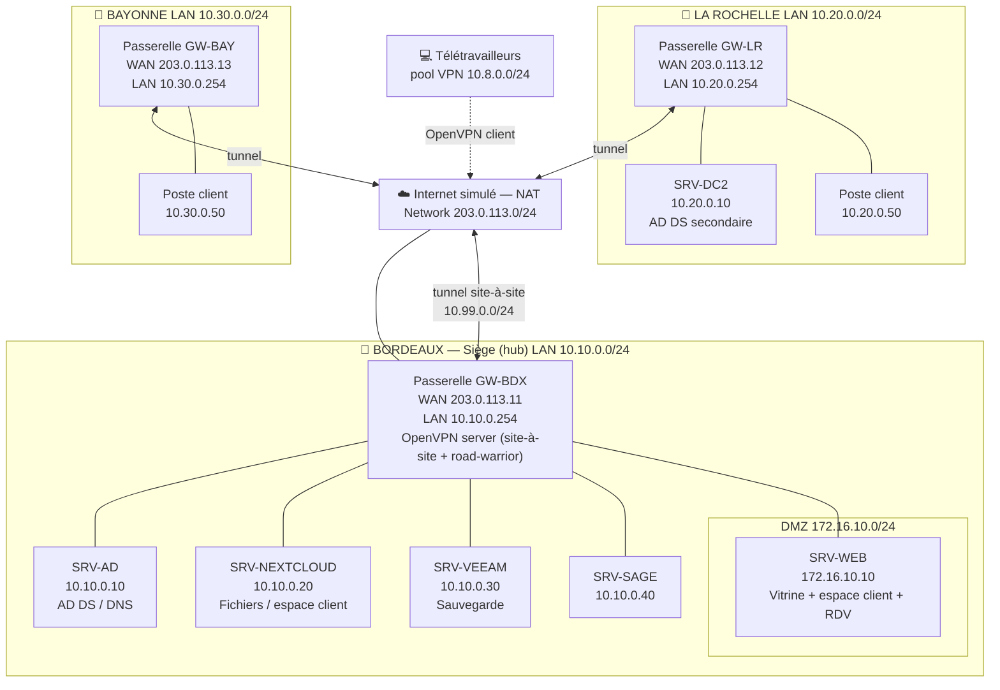

# 02 — Architecture cible

## 2.1 Principe général

Topologie **en étoile (hub-and-spoke)** : **Bordeaux** est le concentrateur (hub), **La Rochelle** et **Bayonne** sont les branches (spokes). Toutes les liaisons inter-sites transitent par des tunnels **OpenVPN** chiffrés. Le télétravail se raccorde au hub via un tunnel **OpenVPN client** distinct.

Pourquoi l'étoile plutôt qu'un maillage complet :

- le siège héberge déjà l'annuaire, les fichiers et le dépôt de sauvegarde : le trafic converge naturellement vers Bordeaux ;
- ajouter un 4ᵉ ou 5ᵉ site = ajouter **une** branche, sans retoucher les sites existants (l'antenne de Bayonne valide ce choix) ;
- une seule politique de filtrage et de routage à maintenir au centre.

Contrepartie (panne du hub) traitée dans le [PRA/PCA](08-pra-pca.md) via un contrôleur de domaine secondaire à La Rochelle.

## 2.2 Schéma de topologie

## 2.3 Plan d'adressage

### Réseaux

| Rôle | Réseau | Type VirtualBox | Nom réseau VBox |
|---|---|---|---|
| Internet simulé (WAN) | `203.0.113.0/24` | NAT Network | `inet-sim` |
| LAN Bordeaux | `10.10.0.0/24` | Internal Network | `lan-bdx` |
| DMZ Bordeaux | `172.16.10.0/24` | Internal Network | `dmz-bdx` |
| LAN La Rochelle | `10.20.0.0/24` | Internal Network | `lan-lr` |
| LAN Bayonne | `10.30.0.0/24` | Internal Network | `lan-bay` |
| Tunnel site-à-site | `10.99.0.0/24` | (logique OpenVPN) | — |
| Pool VPN télétravail | `10.8.0.0/24` | (logique OpenVPN) | — |

### Adresses fixes

| Hôte | WAN | LAN / DMZ | IP tunnel | Rôle |
|---|---|---|---|---|
| GW-BDX | 203.0.113.11 | 10.10.0.254 / 172.16.10.254 | 10.99.0.1 | Passerelle hub, OpenVPN server |
| GW-LR | 203.0.113.12 | 10.20.0.254 | 10.99.0.2 | Passerelle La Rochelle |
| GW-BAY | 203.0.113.13 | 10.30.0.254 | 10.99.0.3 | Passerelle Bayonne |
| SRV-AD | — | 10.10.0.10 | — | AD DS + DNS (primaire) |
| SRV-NEXTCLOUD | — | 10.10.0.20 | — | Fichiers / espace client |
| SRV-VEEAM | — | 10.10.0.30 | — | Sauvegarde |
| SRV-SAGE | — | 10.10.0.40 | — | Comptabilité / paie |
| SRV-WEB | — | 172.16.10.10 (DMZ) | — | Vitrine + espace client + RDV |
| SRV-DC2 | — | 10.20.0.10 | — | AD DS secondaire + DNS |
| Poste LR | — | 10.20.0.50 | — | Client de test |
| Poste BAY | — | 10.30.0.50 | — | Client de test |

> Les passerelles portent l'adresse `.254` de leur LAN : c'est la **passerelle par défaut** de tous les hôtes du site.

## 2.4 Routage et flux

- **LAN → Internet** : chaque passerelle fait du **NAT (masquerade)** sur son interface WAN, sauf pour le trafic à destination de `10.0.0.0/8` (inter-sites) qui passe **en clair logique mais chiffré dans le tunnel**, sans NAT.
- **Inter-sites** : routage pur via `tun0`. Le hub connaît les routes vers `10.20.0.0/24` et `10.30.0.0/24` ; les spokes reçoivent par `push` les routes vers tous les LAN. `client-to-client` autorise La Rochelle ↔ Bayonne **à travers** le hub.
- **Télétravail → ressources internes** : le pool `10.8.0.0/24` reçoit les routes vers les 3 LAN et la DMZ.
- **DMZ** : le serveur web est isolé. Depuis Internet, seuls **443/80** sont redirigés vers `172.16.10.10`. La DMZ **ne peut pas initier** de connexion vers le LAN (règle de cloisonnement). Le LAN peut administrer la DMZ.

## 2.5 Choix techniques justifiés

| Choix | Justification |
|---|---|
| **OpenVPN** (vs IPsec) | Imposé par l'entretien. Avantages : passe les NAT/pare-feu en UDP/443 au besoin, PKI claire (X.509), configuration en fichiers texte versionnables — idéal pour un dépôt git. |
| **Passerelles Debian** (vs pfSense) | Léger pour VirtualBox, configurations en **fichiers texte** lisibles et reversionnables dans ce dépôt, démontre la maîtrise Linux/réseau. pfSense reste une alternative GUI valable. |
| **Étoile** (vs maillage) | Trafic centré sur le siège, ajout de site trivial (Bayonne le prouve), filtrage centralisé. |
| **Nextcloud** (vs OneDrive) | Auto-hébergé → coûts maîtrisés ; **journalisation native des accès** (app `admin_audit`) répondant directement à l'exigence CNIL ; partages externes pour l'espace client. |
| **DMZ pour le web** | Un service exposé à Internet ne doit jamais être dans le LAN de production : en cas de compromission, l'attaquant n'atteint pas directement les données clients. |
| **DC secondaire à La Rochelle** | L'authentification survit à une panne de Bordeaux → brique de PCA. |
| **Veeam** | Imposé par l'entretien ; gère l'incrémental, les **Backup Copy Jobs** hors-site et l'immuabilité. |

## 2.6 Vue par couche (résumé)

- **Couche WAN/Internet** : NAT Network `inet-sim` (203.0.113.0/24).
- **Couche périmètre** : 3 passerelles Debian (NAT, pare-feu nftables, OpenVPN).
- **Couche services** : AD/DNS, Nextcloud, Veeam, Sage (LAN Bordeaux) ; web (DMZ) ; DC2 (LAN La Rochelle).
- **Couche poste** : clients en agence + télétravailleurs en VPN.
