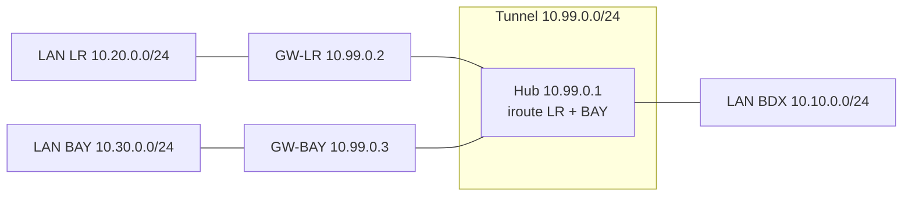

# 04 — VPN site-à-site OpenVPN (étoile)

Objectif : relier **en permanence** les LAN de Bordeaux, La Rochelle et Bayonne par des tunnels chiffrés. Bordeaux est le **serveur** (hub) ; La Rochelle et Bayonne sont des **clients** (spokes). `client-to-client` permet aux deux agences de communiquer en transitant par le hub.

## 4.1 La PKI (Easy-RSA)

On génère **une autorité de certification** et un certificat par passerelle. Tout se fait sur le hub (Bordeaux), puis on distribue les fichiers nécessaires.

```bash
sudo apt update && sudo apt install -y openvpn easy-rsa

make-cadir ~/easyrsa && cd ~/easyrsa
./easyrsa init-pki
./easyrsa build-ca nopass                      # CA (renseigner un CN, ex: FIDUCIS-CA)

# Serveur (hub)
./easyrsa gen-req bordeaux nopass
./easyrsa sign-req server bordeaux

# Spokes
./easyrsa gen-req larochelle nopass
./easyrsa sign-req client larochelle
./easyrsa gen-req bayonne nopass
./easyrsa sign-req client bayonne

# Paramètres Diffie-Hellman + clé TLS d'authentification (anti-DoS)
./easyrsa gen-dh
openvpn --genkey secret ta.key
```

Fichiers produits (dans `~/easyrsa/pki/`) :

| Fichier | Destinataire |
|---|---|
| `ca.crt` | hub + tous les spokes |
| `issued/bordeaux.crt`, `private/bordeaux.key` | hub uniquement |
| `dh.pem`, `ta.key` | hub (et `ta.key` copié sur les spokes) |
| `issued/larochelle.crt`, `private/larochelle.key` | GW-LR |
| `issued/bayonne.crt`, `private/bayonne.key` | GW-BAY |

> Les clés **privées** ne quittent jamais inutilement le hub : on copie sur chaque spoke **uniquement** son propre couple cert/clé, plus `ca.crt` et `ta.key`. Transfert via `scp` à travers le LAN d'administration (ou clé USB en montage initial).

Le script [`scripts/init-pki.sh`](../scripts/init-pki.sh) enchaîne ces commandes.

## 4.2 Configuration du serveur (Bordeaux)

Fichier `/etc/openvpn/server/site2site.conf` — version complète dans [`configs/openvpn/server-site2site.conf`](../configs/openvpn/server-site2site.conf).

```ini
port 1194
proto udp
dev tun

ca       ca.crt
cert     bordeaux.crt
key      bordeaux.key
dh       dh.pem
tls-auth ta.key 0

# Réseau du tunnel ; topology subnet = adressage moderne
topology subnet
server 10.99.0.0 255.255.255.0

# Affectation fixe d'IP et routes internes par spoke
client-config-dir /etc/openvpn/ccd
client-to-client            # LR <-> Bayonne via le hub

# Routes vers les LAN distants dans la table du serveur
route 10.20.0.0 255.255.255.0
route 10.30.0.0 255.255.255.0

# Routes poussées à TOUS les spokes (ils apprennent les autres LAN)
push "route 10.10.0.0 255.255.255.0"
push "route 10.20.0.0 255.255.255.0"
push "route 10.30.0.0 255.255.255.0"

keepalive 10 120
persist-key
persist-tun

# Durcissement
cipher AES-256-GCM
auth SHA256
tls-version-min 1.2
remote-cert-tls client
user nobody
group nogroup

status /var/log/openvpn/s2s-status.log
log-append /var/log/openvpn/s2s.log
verb 3
```

### Fichiers CCD (un par spoke)

Ils fixent l'IP de tunnel de chaque agence et déclarent **quel LAN se trouve derrière** (directive `iroute`, indispensable pour que le serveur route le retour).

`/etc/openvpn/ccd/larochelle` :
```ini
ifconfig-push 10.99.0.2 255.255.255.0
iroute 10.20.0.0 255.255.255.0
```

`/etc/openvpn/ccd/bayonne` :
```ini
ifconfig-push 10.99.0.3 255.255.255.0
iroute 10.30.0.0 255.255.255.0
```

> **`route` vs `iroute`** — `route` ajoute la route dans le **noyau** du serveur (le système sait joindre le réseau). `iroute` est **interne à OpenVPN** : il associe un sous-réseau à un client donné pour aiguiller le trafic vers le bon tunnel. Les deux sont nécessaires.

## 4.3 Configuration des spokes

### La Rochelle — `/etc/openvpn/client/site2site.conf`
([`configs/openvpn/client-larochelle.conf`](../configs/openvpn/client-larochelle.conf))

```ini
client
dev tun
proto udp
remote 203.0.113.11 1194        # WAN du hub Bordeaux
resolv-retry infinite
nobind

ca       ca.crt
cert     larochelle.crt
key      larochelle.key
tls-auth ta.key 1
remote-cert-tls server

cipher AES-256-GCM
auth SHA256
tls-version-min 1.2
persist-key
persist-tun
keepalive 10 120
verb 3
```

Bayonne est identique en remplaçant `larochelle` par `bayonne`.

## 4.4 Pare-feu et NAT (nftables)

Sur **chaque** passerelle, on autorise le forwarding du tunnel et on NATe la sortie Internet **sauf** vers les réseaux internes. Exemple Bordeaux — version complète : [`configs/openvpn/nftables-gw-bdx.conf`](../configs/openvpn/nftables-gw-bdx.conf).

```bash
# /etc/nftables.conf (extrait)
table inet fw {
  chain forward {
    type filter hook forward priority 0; policy drop;
    ct state established,related accept
    iifname "tun0" accept            # depuis le tunnel
    oifname "tun0" accept            # vers le tunnel
    iifname "enp0s8" oifname "enp0s3" accept   # LAN -> Internet
    # DMZ ne peut PAS initier vers le LAN (cloisonnement)
    iifname "enp0s9" oifname "enp0s8" drop
  }
}
table ip nat {
  chain postrouting {
    type nat hook postrouting priority 100; policy accept;
    # NAT pour Internet, mais PAS pour l'inter-sites (10.0.0.0/8)
    ip saddr 10.10.0.0/24 ip daddr != 10.0.0.0/8 oifname "enp0s3" masquerade
  }
}
```

Côté **hub**, on ouvre le port OpenVPN entrant :
```bash
# autoriser UDP/1194 sur le WAN du hub
nft add rule inet fw input udp dport 1194 accept
```

## 4.5 Mise en service

```bash
# Hub
sudo systemctl enable --now openvpn-server@site2site

# Spokes
sudo systemctl enable --now openvpn-client@site2site
```

## 4.6 Validation

```bash
# Le tunnel est monté ? (sur le hub)
cat /var/log/openvpn/s2s-status.log    # larochelle et bayonne présents

# Bordeaux joint un poste de La Rochelle :
ping -c3 10.20.0.50

# La Rochelle joint Bayonne (à travers le hub, grâce à client-to-client) :
ping -c3 10.30.0.50    # depuis 10.20.0.50

# Un poste de La Rochelle accède aux fichiers (Nextcloud à Bordeaux) :
curl -I https://10.10.0.20
```

Schéma logique des routes après établissement :



➡️ Les trois sites sont reliés en permanence. On ajoute ensuite le **VPN télétravail** ([docs/05](05-vpn-teletravail.md)).
