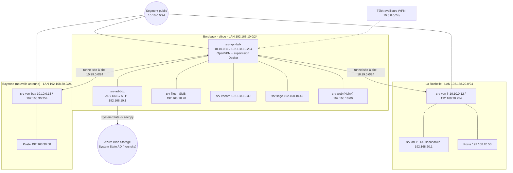
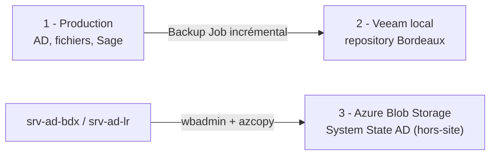

# MSPR FIDUCIS — dossier technique

Cabinet d'expertise comptable, juridique et conseil RH, 35 collaborateurs, répartis sur Bordeaux (siège), La Rochelle, Bayonne (nouvelle antenne) et du télétravail régulier. Au départ, les fichiers sont sur OneDrive, le site vitrine et l'espace client chez un prestataire coûteux, et il n'y a ni VPN, ni sauvegarde, ni plan de reprise. Un contrôle CNIL impose de tracer les accès aux données clients, et une coupure Internet d'une journée à La Rochelle a déjà bloqué le travail.

Ce dépôt regroupe l'architecture, la maquette VirtualBox, les configurations réelles (OpenVPN, pare-feu, Nginx, supervision Docker, NTP), le code Terraform de la sauvegarde Azure et le site web. Virtualisation sous VirtualBox, passerelles/serveurs VPN sous Ubuntu 24.04, serveurs métier sous Windows Server 2022.

## Réponses aux entretiens

| Demande (entretiens) | Réponse mise en place |
|---|---|
| Accès entre Bordeaux, La Rochelle et le télétravail (pas de VPN, OneDrive aujourd'hui) | VPN site-à-site OpenVPN reliant les LAN en permanence + VPN client pour les télétravailleurs |
| Nouvelle antenne à Bayonne (2e entretien) | Bayonne intégrée comme branche du VPN site-à-site (topologie en étoile, hub Bordeaux) |
| Coupure Internet à La Rochelle (tout était bloqué) | Lien de secours par site dans le PRA ; les services internalisés restent disponibles en local |
| Pas de sauvegarde | Sauvegarde 3-2-1 : Veeam en local + System State de l'AD vers Azure Blob Storage |
| Toutes les données sont sensibles | Chiffrement en transit et au repos, accès en moindre privilège |
| Pas de PRA/PCA | PRA et PCA documentés et testés |
| Traçabilité des accès clients (CNIL, 2e entretien) | Audit NTFS des accès fichiers + journaux centralisés + VPN nominatif |
| Tout rapatrier en interne (2e entretien) | Fichiers sur serveur SMB interne, site web rapatrié en interne (Nginx) |

Ajouts : rôle NTP sur le DC, supervision Prometheus + Grafana en Docker, et provisionnement du stockage de sauvegarde Azure par Terraform.

## Architecture

Topologie en étoile : Bordeaux concentre les services, La Rochelle et Bayonne sont des branches reliées par des tunnels OpenVPN. Chaque site possède un serveur VPN (srv-vpn-bdx / srv-vpn-lr / srv-vpn-bay) qui fait office de passerelle entre son LAN interne et le segment public. Ajouter un site (Bayonne) revient à ajouter une branche sans toucher aux autres. La contrepartie (panne du hub) est traitée par un contrôleur de domaine secondaire à La Rochelle dans le PRA.



### Plan d'adressage

| Rôle | Réseau | Type VirtualBox |
|---|---|---|
| Segment public (serveurs VPN) | `10.10.0.0/24` | NAT Network `inet-sim` |
| LAN Bordeaux | `192.168.10.0/24` | Internal `lan-bdx` |
| LAN La Rochelle | `192.168.20.0/24` | Internal `lan-lr` |
| LAN Bayonne | `192.168.30.0/24` | Internal `lan-bay` |
| Tunnel site-à-site | `10.99.0.0/24` | OpenVPN |
| Pool télétravail | `10.8.0.0/24` | OpenVPN |

Serveurs VPN (public / LAN) : srv-vpn-bdx 10.10.0.11 / 192.168.10.254, srv-vpn-lr 10.10.0.12 / 192.168.20.254, srv-vpn-bay 10.10.0.13 / 192.168.30.254. Bordeaux : srv-ad-bdx 192.168.10.1 (AD/DNS/NTP), srv-files 192.168.10.20, srv-veeam 192.168.10.30, srv-sage 192.168.10.40, srv-web 192.168.10.60. La Rochelle : srv-ad-lr 192.168.20.1 (DC secondaire) + un poste. Bayonne : un poste (192.168.30.50), l'antenne ne portant pas de serveur pour l'instant.

## Maquette VirtualBox

| VM | OS | RAM | Réseaux |
|---|---|---|---|
| srv-vpn-bdx | Ubuntu 24.04 | 1 Go | public + LAN Bordeaux (OpenVPN + Docker supervision) |
| srv-vpn-lr / srv-vpn-bay | Ubuntu 24.04 | 512 Mo | public + LAN du site |
| srv-ad-bdx | Windows Server 2022 | 2 Go | LAN Bordeaux (AD/DNS/NTP) |
| srv-files | Windows Server 2022 | 2 Go | LAN Bordeaux |
| srv-veeam | Windows Server 2022 | 4 Go | LAN Bordeaux |
| srv-sage | Windows Server 2022 | 2 Go | LAN Bordeaux |
| srv-web | Ubuntu 24.04 | 512 Mo | LAN Bordeaux (Nginx) |
| srv-ad-lr | Windows Server 2022 (Core) | 2 Go | LAN La Rochelle |
| Poste La Rochelle / Bayonne | Windows 10/11 | 2 Go | LAN du site |

Le NAT Network `inet-sim` (10.10.0.0/24) joue le segment « public » qui relie les serveurs VPN et leur donne accès à Internet pour les mises à jour. Les LAN sont des Internal Networks. La création est scriptée (`scripts/provision-virtualbox.sh`). On démarre les VM par groupe selon la démo plutôt que toutes ensemble.

Le réseau sous Ubuntu 24.04 se configure avec Netplan. Exemple pour le serveur VPN de Bordeaux (`/etc/netplan/01-fiducis.yaml`, chmod 600 puis `sudo netplan apply`) :

```yaml
network:
  version: 2
  renderer: networkd
  ethernets:
    enp0s3:                 # segment public
      addresses: [10.10.0.11/24]
      routes: [{to: default, via: 10.10.0.1}]
    enp0s8:                 # LAN Bordeaux
      addresses: [192.168.10.254/24]
```

Le routage est activé sur les serveurs VPN (`net.ipv4.ip_forward=1`).

## VPN site-à-site (Bordeaux, La Rochelle, Bayonne)

srv-vpn-bdx est serveur OpenVPN, srv-vpn-lr et srv-vpn-bay sont clients. Bayonne, ouverte au 2e entretien, est raccordée exactement comme La Rochelle : une branche de plus sur l'étoile. `client-to-client` permet aux deux agences de communiquer en passant par le hub. La PKI (Easy-RSA) génère une autorité de certification et un certificat par serveur VPN (`scripts/init-pki.sh`). Chaque agence est déclarée dans un fichier CCD avec son IP de tunnel et la route vers son LAN (`iroute`).

Extrait du serveur (`configs/openvpn/server-site2site.conf`) :

```ini
topology subnet
server 10.99.0.0 255.255.255.0
client-config-dir /etc/openvpn/ccd
client-to-client
route 192.168.20.0 255.255.255.0
route 192.168.30.0 255.255.255.0
push "route 192.168.10.0 255.255.255.0"
push "route 192.168.20.0 255.255.255.0"
push "route 192.168.30.0 255.255.255.0"
```

Le pare-feu et le NAT sont dans `configs/openvpn/nftables-gw-bdx.conf` : le trafic inter-sites (192.168.0.0/16) n'est pas NATé, seul l'accès Internet l'est ; la publication web (80/443) est redirigée vers srv-web.

## VPN télétravail

Une seconde instance OpenVPN tourne sur srv-vpn-bdx (port et sous-réseau distincts), avec un certificat par collaborateur, révocable individuellement — ce qui permet aussi d'identifier nominativement qui se connecte. Le profil `.ovpn` est assemblé par `scripts/make-ovpn.sh`. On reste en split-tunnel : seul le trafic vers les ressources internes passe par le VPN. Une fois connecté, le télétravailleur accède au partage SMB et à Sage selon ses droits AD. Révocation (départ, perte de portable) : `easyrsa revoke`, régénération de la CRL, activation de `crl-verify`.

## Annuaire, DNS et temps (NTP)

srv-ad-bdx (192.168.10.1) porte l'Active Directory et le DNS interne, et sert de source de temps NTP pour tout le domaine : le DC détenteur du rôle PDC se synchronise sur des serveurs NTP fiables, les postes et serveurs prennent l'heure depuis l'AD. Une heure cohérente est indispensable à Kerberos, à l'horodatage des journaux d'audit (CNIL) et à la corrélation des métriques de supervision. Configuration `w32time` dans `configs/ad/ntp-dc.md`.

## Internalisation des fichiers et du web

Les fichiers quittent OneDrive pour un serveur de fichiers Windows (srv-files), partages SMB intégrés à l'AD. Les permissions suivent des groupes AD par métier (comptables, juristes, RH, direction) en moindre privilège, avec l'énumération basée sur l'accès. La migration se fait par export OneDrive puis copie sur les partages, et déploiement des lecteurs réseau par GPO.

Le site vitrine, l'espace client et la prise de rendez-vous sont rapatriés en interne sur srv-web sous Nginx. Le site est livré dans ce dépôt (`web/site/index.html`, un seul fichier HTML autonome) et sa configuration dans `configs/web/fiducis-vitrine.conf` (HTTPS forcé, en-têtes de sécurité, URL propres, reverse proxy `/rdv/` et `/espace-client/` vers les applications internes). Le site est purement front-end et ne stocke aucune donnée client. Sage reste sur srv-sage, joignable depuis toutes les agences via le tunnel et inclus dans les sauvegardes.

## Supervision (Prometheus + Grafana, Docker)

La supervision tourne en conteneurs Docker sur srv-vpn-bdx : Prometheus collecte les métriques, Grafana affiche les tableaux de bord (datasource Prometheus auto-provisionnée), node-exporter expose les métriques système. Tout est dans `configs/monitoring/` (`docker-compose.yml`, `prometheus/prometheus.yml`, `grafana/provisioning/`).

Cibles actuelles (`prometheus.yml`) :

```yaml
scrape_configs:
  - job_name: 'vpn-servers'
    static_configs:
      - targets: ['10.10.0.11:9100']   # srv-vpn-bdx
      - targets: ['10.10.0.12:9100']   # srv-vpn-lr
      - targets: ['10.10.0.13:9100']   # srv-vpn-bay
  - job_name: 'ad-dns-bordeaux'
    static_configs:
      - targets: ['192.168.10.1:9182'] # srv-ad-bdx (windows_exporter)
```

node_exporter (Linux) et windows_exporter (Windows) exposent les flux réseau, l'état des cartes réseau et le stockage (IOPS, débit disque, Go libres) — visualisés dans Grafana et extensibles à d'autres serveurs (fichiers, Veeam, Sage, web, srv-ad-lr) en ajoutant des cibles.

Alertes mail (optionnel) : `configs/monitoring/alertmanager.yml` et `alert-rules.yml` sont fournis pour envoyer un mail dès qu'une cible tombe (`up == 0` pendant 1 min) ou qu'un disque sature ; il suffit d'ajouter le service alertmanager au compose et les directives `rule_files` / `alerting` à `prometheus.yml` (détails dans `configs/monitoring/README.md`).

## Sauvegarde 3-2-1 (Veeam local + Azure Blob Storage)

Trois copies, deux supports différents, une hors-site :



En local, **Veeam** sauvegarde les serveurs et les fichiers (copie de production + repository local sur srv-veeam). Pour l'annuaire, la copie hors-site est externalisée sur **Azure Blob Storage** : le **System State** des contrôleurs de domaine (srv-ad-bdx, et le réplica srv-ad-lr) est sauvegardé par `wbadmin start systemstatebackup` puis envoyé dans un conteneur Blob `ad-systemstate` via azcopy, sous un préfixe horodaté, par une tâche planifiée quotidienne.

Le Blob Storage est provisionné par **Terraform** (`terraform/`) :

- compte de stockage StorageV2 au nom unique `stadbkpbdx<suffixe aléatoire>`, `access_tier = Cool`, TLS 1.2, HTTPS only, versioning + corbeille 30 jours ;
- conteneur Blob privé `ad-systemstate` ;
- politique de cycle de vie : passage en *cool* après 7 jours, en *archive* après 30 jours, suppression après 180 jours, et purge des versions après 90 jours (coûts maîtrisés).

Le code Terraform a été **écrit et validé en local** (`terraform init` / `validate` / `plan`, providers azurerm ~> 4.0 et random) **mais n'a pas pu être appliqué sur Azure** : aucun abonnement actif n'était disponible au moment du rendu (le `terraform.tfstate` ne contient aucune ressource). Le provisionnement réel et la planification sont décrits dans `terraform/README.md` (avec `terraform/backup-ad.ps1`).

| Données | Mécanisme | Hors-site |
|---|---|---|
| Fichiers / pièces clients, Sage | Veeam (incrémental quotidien, repository local) | à compléter selon besoin |
| Annuaire (System State AD) | wbadmin + azcopy, quotidien | Azure Blob `ad-systemstate` (cool/archive) |

On teste réellement les restaurations (fichier mensuellement, AD par trimestre en mode DSRM). Une sauvegarde non testée ne compte pas. Chaque test fait l'objet d'un PV daté. Rappel : ne pas restaurer un System State plus vieux que la *tombstone lifetime* (180 jours).

## PRA / PCA

| Service | RPO | RTO |
|---|---|---|
| Sage / fichiers clients | 24 h | 4 h |
| Active Directory / DNS | réplication (~0) | < 1 h |
| Site web / espace client | 24 h | 8 h |

Continuité : srv-ad-lr (La Rochelle) maintient l'authentification en cas de panne du siège ; les services internalisés restent disponibles localement ; la supervision permet de détecter une panne immédiatement. Reprise : restauration depuis le repository Veeam local pour un incident isolé, ou restauration du System State depuis Azure Blob (mode DSRM) en cas de sinistre du DC. Les runbooks (restauration d'un fichier, sinistre du siège, ransomware) sont écrits pour pouvoir être suivis sans expertise pointue.

À noter pour la coupure Internet vécue à La Rochelle : un VPN seul ne la règle pas, puisque le tunnel a besoin du lien pour monter. La vraie continuité repose sur un lien de secours par site (4G/5G ou second FAI), conçu et documenté dans le PRA mais simulé dans la maquette faute de matériel.

## Traçabilité CNIL

La traçabilité des accès aux fichiers clients s'appuie sur l'audit d'accès aux objets NTFS de srv-files : une GPO active l'audit du système de fichiers, et des SACL sont posées sur les dossiers sensibles, ce qui journalise qui accède à quel dossier et quand (`configs/ad/audit-fichiers.gpo.md`, évènements 4663/4670). Les journaux sont centralisés et conservés de façon proportionnée (environ 6 mois pour les accès, 12 mois pour les évènements de sécurité). S'ajoutent les certificats VPN nominatifs, le chiffrement en transit et au repos, et une matrice d'habilitation par groupe AD. On peut ainsi produire, pour un dossier client donné, la liste horodatée des accès demandée par la CNIL.

## Tests principaux

| Test | Résultat attendu |
|---|---|
| Tunnels site-à-site | La Rochelle et Bayonne connectés au hub |
| Communication inter-agences | La Rochelle joint Bayonne via le hub |
| Accès aux ressources | Sage et partage SMB accessibles depuis une agence distante |
| VPN télétravail | Connexion, accès interne, révocation d'un certificat refusée |
| Sauvegarde AD | wbadmin produit le System State, azcopy l'envoie dans le conteneur Azure |
| Supervision | Grafana affiche les métriques des serveurs VPN et de l'AD ; cible down visible |
| NTP | Les postes et serveurs sont synchronisés sur l'heure du DC |
| Audit NTFS | Un accès à un dossier sensible génère un évènement horodaté |

## Contenu du dépôt

- `configs/openvpn/` : serveurs et clients (site-à-site Bordeaux/La Rochelle/Bayonne + télétravail), CCD, pare-feu nftables
- `configs/web/` : configuration Nginx du site
- `configs/ad/` : GPO d'audit des accès fichiers (CNIL) et configuration NTP du DC
- `configs/monitoring/` : stack Docker Prometheus + Grafana + node-exporter (vos fichiers réels) et extension alertes mail
- `terraform/` : provisionnement Azure Blob Storage pour la sauvegarde du System State AD (code réel, validé en local, non encore appliqué sur Azure) + `backup-ad.ps1`
- `web/site/` : le site FIDUCIS (un seul fichier HTML autonome)
- `scripts/` : provisioning VirtualBox, génération de la PKI, profils .ovpn

Les certificats, clés, secrets et états Terraform (`*.tfstate`, `terraform.tfvars`) ne sont pas versionnés (voir `.gitignore`). Le fichier de verrouillage `.terraform.lock.hcl` est conservé pour figer les versions de providers.
