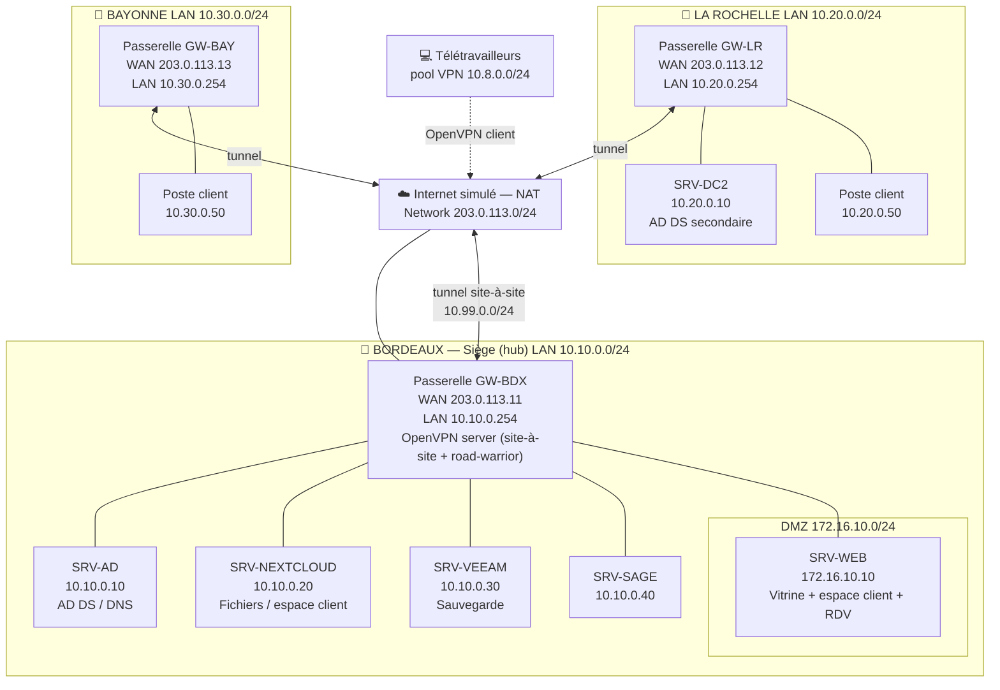
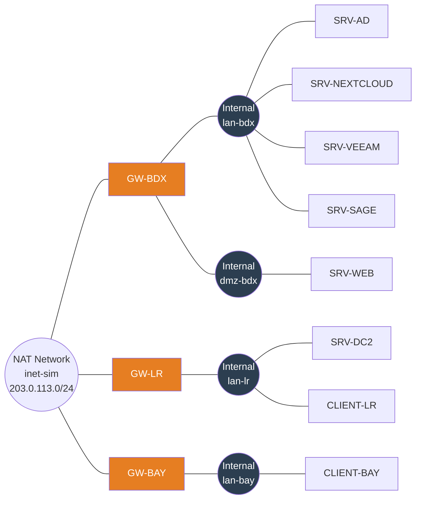
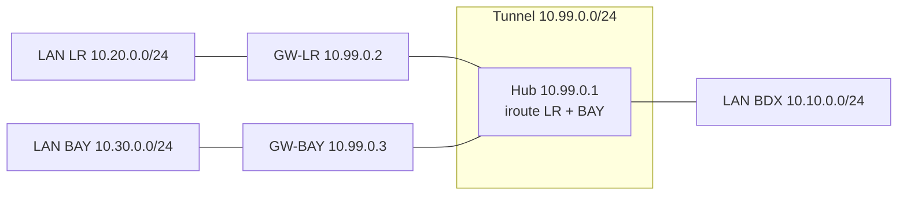
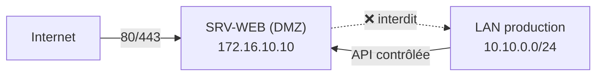
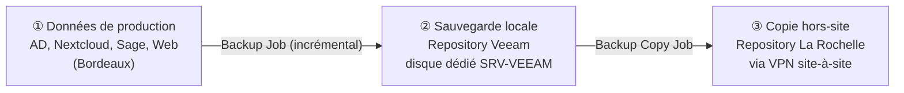
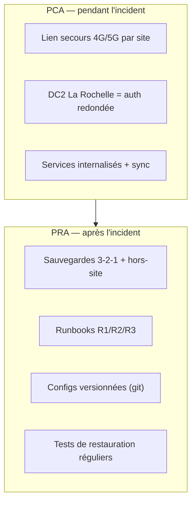

# Dossier technique — MSPR FIDUCIS (Groupe 4)

> Cabinet d'expertise comptable, juridique et conseil RH — refonte réseau, sécurisation et internalisation des services. Virtualisation sous **VirtualBox**.

**Synthèse** : FIDUCIS (35 collaborateurs) sur Bordeaux (siège), La Rochelle, Bayonne (nouvelle antenne) et télétravail, dépendait de services externes (OneDrive, hébergement web) sans VPN, sans sauvegarde, sans plan de reprise, et fait face à un contrôle CNIL. Objectif : **tout rapatrier en interne**, **relier les sites en permanence**, **sécuriser la continuité d'activité**.

| Besoin (entretiens) | Solution |
|---|---|
| Relier Bordeaux / La Rochelle / Bayonne en permanence | VPN site-à-site OpenVPN en étoile (hub = Bordeaux) |
| Télétravailleurs sans OneDrive | VPN client (road-warrior) OpenVPN sur la passerelle de Bordeaux |
| Sortir de OneDrive + web/espace client externes | Internalisation : Nextcloud + serveur web en DMZ |
| Aucune sauvegarde | Sauvegarde 3-2-1 avec Veeam (incrémental + copie hors-site) |
| Aucun plan de reprise | PRA + PCA documentés et testés |
| Traçabilité CNIL des accès clients | Journalisation Nextcloud (admin_audit) + audit NTFS + logs VPN nominatifs |


## Sommaire

- [1. Contexte et analyse du besoin](#1-contexte-et-analyse-du-besoin)
- [2. Architecture cible](#2-architecture-cible)
- [3. Maquette VirtualBox](#3-maquette-virtualbox)
- [4. VPN site-à-site OpenVPN (étoile)](#4-vpn-site-à-site-openvpn-étoile)
- [5. VPN télétravail (road-warrior)](#5-vpn-télétravail-road-warrior)
- [6. Internalisation des services](#6-internalisation-des-services)
- [7. Sauvegarde 3-2-1 (Veeam)](#7-sauvegarde-3-2-1-veeam)
- [8. PRA et PCA](#8-pra-et-pca)
- [9. Conformité RGPD et traçabilité CNIL](#9-conformité-rgpd-et-traçabilité-cnil)
- [10. Tests et recette](#10-tests-et-recette)
- [Annexes — fichiers de configuration](#annexes--fichiers-de-configuration)

---

# 1. Contexte et analyse du besoin

## 1.1 L'entreprise

FIDUCIS est un cabinet d'**expertise comptable, juridique et conseil RH** de **35 collaborateurs**. L'activité repose intégralement sur la manipulation de **données clients sensibles** (comptabilité, paie, pièces juridiques), avec une forte exigence de confidentialité et, désormais, de traçabilité.

**Implantations :**

- **Bordeaux** — siège
- **La Rochelle** — agence
- **Bayonne** — nouvelle antenne (issue du 2ᵉ entretien)
- **Télétravail** — régulier, 2 jours / semaine

## 1.2 Existant

| Domaine | Outil actuel | Localisation |
|---|---|---|
| Collaboration / fichiers | Microsoft 365, OneDrive | **Externe (cloud)** |
| Comptabilité / paie | Sage | Local (10 utilisateurs simultanés max) |
| Identité | Active Directory | Windows Server **local** |
| Fichiers | Partages | Serveur **local** |
| Téléphonie | VoIP (softphone télétravail, postes fixes en agence) | Mixte |
| Web | Site vitrine + espace client + prise de RDV | **Externe (prestataire)** |

**Parc :** laptops nomades pour une partie des équipes, scanners haute volumétrie, salles de visioconférence par agence.

## 1.3 Problèmes constatés (fiche de situation)

- Explosion de la volumétrie documentaire (scans, pièces clients).
- Site vitrine et espace client hébergés chez un prestataire **coûteux**.
- Pression RGPD et **traçabilité des accès aux dossiers**.
- **Coupure Internet d'une journée** récente sur le site de La Rochelle.
- **Aucun plan de reprise formalisé.**

## 1.4 Synthèse du 1ᵉʳ entretien

> Le professeur incarnait FIDUCIS. Les réponses ci-dessous orientent directement l'architecture.

**Accès inter-sites / télétravail.** Aujourd'hui : **pas de VPN**, tout passe par OneDrive. Décision :
- **VPN site-à-site** de Bordeaux à La Rochelle pour relier les deux LAN **en permanence** ;
- **VPN client** sur la passerelle de Bordeaux pour les télétravailleurs ;
- techno : **OpenVPN**.

**Impact de la coupure La Rochelle.** Impossible de contacter les clients par mail, uploads impossibles, **OneDrive inaccessible**, télétravail à l'arrêt — activité totalement bloquée. Le VPN est attendu comme une partie de la réponse.

**Politique de sauvegarde.** Aucune aujourd'hui (ni OneDrive, ni Sage). Décision :
- règle **3-2-1** (3 copies, 2 supports différents, 1 hors-site) ;
- **Veeam** en sauvegarde **incrémentale**, exploitable sur les deux sites grâce au VPN site-à-site.

**Données critiques.** **Tout** est considéré sensible — niveau de protection maximal sur l'ensemble.

**PRA / PCA.** **Rien en place.** Décision : **mettre en place un PRA et un PCA**.

## 1.5 Synthèse du 2ᵉ entretien (ajouts)

- **Nouvelle antenne à Bayonne** → à intégrer au VPN inter-sites (l'étoile passe de 2 à 3 branches).
- **Contrôle CNIL** → besoin de **traçabilité des accès aux données clients** (qui accède à quel dossier, quand).
- **Tout rapatrier en interne** → sortie de OneDrive/M365 pour les fichiers et internalisation du site web et de l'espace client.

## 1.6 Objectifs retenus pour la cible

1. **Interconnexion permanente** des 3 sites (VPN site-à-site en étoile, hub Bordeaux).
2. **Accès distant sécurisé** pour les télétravailleurs (VPN client).
3. **Internalisation** des fichiers (Nextcloud) et du web (vitrine + espace client + RDV) en **DMZ**.
4. **Sauvegarde 3-2-1** avec Veeam, dont une copie hors-site.
5. **PRA/PCA** documentés et **testés**.
6. **Traçabilité** des accès aux données clients (exigence CNIL).
7. **Réduction des coûts** d'hébergement externe (objectif business).

## 1.7 Contraintes & hypothèses

- **Virtualisation imposée : VirtualBox.** La redondance de lien Internet (4G/5G, second FAI) est **recommandée dans le PRA** mais simulée/documentée plutôt que réellement déployée, faute de moyens matériels — cf. docs/08.
- Sage est conservé tel quel sur un serveur dédié ; seules sa sauvegarde et sa joignabilité inter-sites sont traitées.
- La messagerie : dans une logique « tout en interne » on pourrait l'auto-héberger, mais c'est un projet à fort risque opérationnel (réputation IP, anti-spam). **Choix assumé** : on internalise fichiers + web + espace client (gros postes de coût et de risque CNIL), et on documente la messagerie comme **chantier ultérieur**. Cf. docs/06.

## 1.8 Point de vigilance signalé au client

Un VPN **ne compense pas** une coupure Internet : le tunnel a lui-même besoin du lien pour monter. La continuité réelle face à une panne FAI repose sur un **lien de secours par site** + des **services internalisés** joignables via le tunnel. Ce point structure le PRA/PCA (docs/08).

---

# 2. Architecture cible

## 2.1 Principe général

Topologie **en étoile (hub-and-spoke)** : **Bordeaux** est le concentrateur (hub), **La Rochelle** et **Bayonne** sont les branches (spokes). Toutes les liaisons inter-sites transitent par des tunnels **OpenVPN** chiffrés. Le télétravail se raccorde au hub via un tunnel **OpenVPN client** distinct.

Pourquoi l'étoile plutôt qu'un maillage complet :

- le siège héberge déjà l'annuaire, les fichiers et le dépôt de sauvegarde : le trafic converge naturellement vers Bordeaux ;
- ajouter un 4ᵉ ou 5ᵉ site = ajouter **une** branche, sans retoucher les sites existants (l'antenne de Bayonne valide ce choix) ;
- une seule politique de filtrage et de routage à maintenir au centre.

Contrepartie (panne du hub) traitée dans le PRA/PCA via un contrôleur de domaine secondaire à La Rochelle.

## 2.2 Schéma de topologie



## 2.3 Plan d'adressage

### Réseaux

| Rôle | Réseau | Type VirtualBox | Nom réseau VBox |
|---|---|---|---|
| Internet simulé (WAN) | `203.0.113.0/24` | NAT Network | `inet-sim` |
| LAN Bordeaux | `10.10.0.0/24` | Internal Network | `lan-bdx` |
| DMZ Bordeaux | `172.16.10.0/24` | Internal Network | `dmz-bdx` |
| LAN La Rochelle | `10.20.0.0/24` | Internal Network | `lan-lr` |
| LAN Bayonne | `10.30.0.0/24` | Internal Network | `lan-bay` |
| Tunnel site-à-site | `10.99.0.0/24` | (logique OpenVPN) | — |
| Pool VPN télétravail | `10.8.0.0/24` | (logique OpenVPN) | — |

### Adresses fixes

| Hôte | WAN | LAN / DMZ | IP tunnel | Rôle |
|---|---|---|---|---|
| GW-BDX | 203.0.113.11 | 10.10.0.254 / 172.16.10.254 | 10.99.0.1 | Passerelle hub, OpenVPN server |
| GW-LR | 203.0.113.12 | 10.20.0.254 | 10.99.0.2 | Passerelle La Rochelle |
| GW-BAY | 203.0.113.13 | 10.30.0.254 | 10.99.0.3 | Passerelle Bayonne |
| SRV-AD | — | 10.10.0.10 | — | AD DS + DNS (primaire) |
| SRV-NEXTCLOUD | — | 10.10.0.20 | — | Fichiers / espace client |
| SRV-VEEAM | — | 10.10.0.30 | — | Sauvegarde |
| SRV-SAGE | — | 10.10.0.40 | — | Comptabilité / paie |
| SRV-WEB | — | 172.16.10.10 (DMZ) | — | Vitrine + espace client + RDV |
| SRV-DC2 | — | 10.20.0.10 | — | AD DS secondaire + DNS |
| Poste LR | — | 10.20.0.50 | — | Client de test |
| Poste BAY | — | 10.30.0.50 | — | Client de test |

> Les passerelles portent l'adresse `.254` de leur LAN : c'est la **passerelle par défaut** de tous les hôtes du site.

## 2.4 Routage et flux

- **LAN → Internet** : chaque passerelle fait du **NAT (masquerade)** sur son interface WAN, sauf pour le trafic à destination de `10.0.0.0/8` (inter-sites) qui passe **en clair logique mais chiffré dans le tunnel**, sans NAT.
- **Inter-sites** : routage pur via `tun0`. Le hub connaît les routes vers `10.20.0.0/24` et `10.30.0.0/24` ; les spokes reçoivent par `push` les routes vers tous les LAN. `client-to-client` autorise La Rochelle ↔ Bayonne **à travers** le hub.
- **Télétravail → ressources internes** : le pool `10.8.0.0/24` reçoit les routes vers les 3 LAN et la DMZ.
- **DMZ** : le serveur web est isolé. Depuis Internet, seuls **443/80** sont redirigés vers `172.16.10.10`. La DMZ **ne peut pas initier** de connexion vers le LAN (règle de cloisonnement). Le LAN peut administrer la DMZ.

## 2.5 Choix techniques justifiés

| Choix | Justification |
|---|---|
| **OpenVPN** (vs IPsec) | Imposé par l'entretien. Avantages : passe les NAT/pare-feu en UDP/443 au besoin, PKI claire (X.509), configuration en fichiers texte versionnables — idéal pour un dépôt git. |
| **Passerelles Debian** (vs pfSense) | Léger pour VirtualBox, configurations en **fichiers texte** lisibles et reversionnables dans ce dépôt, démontre la maîtrise Linux/réseau. pfSense reste une alternative GUI valable. |
| **Étoile** (vs maillage) | Trafic centré sur le siège, ajout de site trivial (Bayonne le prouve), filtrage centralisé. |
| **Nextcloud** (vs OneDrive) | Auto-hébergé → coûts maîtrisés ; **journalisation native des accès** (app `admin_audit`) répondant directement à l'exigence CNIL ; partages externes pour l'espace client. |
| **DMZ pour le web** | Un service exposé à Internet ne doit jamais être dans le LAN de production : en cas de compromission, l'attaquant n'atteint pas directement les données clients. |
| **DC secondaire à La Rochelle** | L'authentification survit à une panne de Bordeaux → brique de PCA. |
| **Veeam** | Imposé par l'entretien ; gère l'incrémental, les **Backup Copy Jobs** hors-site et l'immuabilité. |

## 2.6 Vue par couche (résumé)

- **Couche WAN/Internet** : NAT Network `inet-sim` (203.0.113.0/24).
- **Couche périmètre** : 3 passerelles Debian (NAT, pare-feu nftables, OpenVPN).
- **Couche services** : AD/DNS, Nextcloud, Veeam, Sage (LAN Bordeaux) ; web (DMZ) ; DC2 (LAN La Rochelle).
- **Couche poste** : clients en agence + télétravailleurs en VPN.

---

# 3. Maquette VirtualBox

## 3.1 Inventaire des machines virtuelles

| VM | OS | vCPU | RAM | Disque | Réseaux (NIC1 / NIC2 / NIC3) |
|---|---|---|---|---|---|
| `GW-BDX` | Unbuntu 24.04 | 1 | 512 Mo | 8 Go | NAT `inet-sim` / Internal `lan-bdx` / Internal `dmz-bdx` |
| `GW-LR` | Unbuntu 24.04 | 1 | 512 Mo | 8 Go | NAT `inet-sim` / Internal `lan-lr` |
| `GW-BAY` | Unbuntu 24.04 | 1 | 512 Mo | 8 Go | NAT `inet-sim` / Internal `lan-bay` |
| `SRV-AD` | Windows Server 2022 | 2 | 2048 Mo | 40 Go | Internal `lan-bdx` |
| `SRV-NEXTCLOUD` | Unbuntu 24.04 | 2 | 2048 Mo | 30 Go | Internal `lan-bdx` |
| `SRV-VEEAM` | Windows Server 2022 | 2 | 4096 Mo | 60 Go | Internal `lan-bdx` |
| `SRV-WEB` | Unbuntu 24.04 | 1 | 512 Mo | 10 Go | Internal `dmz-bdx` |
| `SRV-SAGE` | Windows Server 2022 | 2 | 2048 Mo | 40 Go | Internal `lan-bdx` |
| `SRV-DC2` | Windows Server 2022 (Core) | 2 | 2048 Mo | 40 Go | Internal `lan-lr` |
| `CLIENT-LR` | Windows 10/11 | 2 | 2048 Mo | 40 Go | Internal `lan-lr` |
| `CLIENT-BAY` | Windows 10/11 | 2 | 2048 Mo | 40 Go | Internal `lan-bay` |

### Budget RAM et fonctionnement par scénarios

L'ensemble pèse ~20 Go de RAM si tout tourne en même temps — rarement nécessaire. **On démarre les VM par groupe selon la démo :**

- **Scénario VPN inter-sites** : `GW-BDX`, `GW-LR`, `GW-BAY`, `CLIENT-LR`, `CLIENT-BAY` (~6 Go).
- **Scénario services internes** : `GW-BDX`, `SRV-AD`, `SRV-NEXTCLOUD`, `SRV-WEB`, un client (~7 Go).
- **Scénario sauvegarde** : `SRV-VEEAM` + cibles (~8 Go).

Astuces VirtualBox pour tenir : Windows Server en **édition Core** (sans GUI), `--paravirtprovider default`, désactivation de l'audio/USB inutiles, disques **dynamiques**.

## 3.2 Schéma de câblage virtuel



## 3.3 Création des réseaux

Le **NAT Network** simule Internet : les VM s'y voient entre elles **et** atteignent le vrai Internet (pratique pour `apt`). On lui force la plage `203.0.113.0/24`.

```bash
# Réseau "Internet"
VBoxManage natnetwork add --netname inet-sim \
  --network "203.0.113.0/24" --enable --dhcp off

# Les Internal Networks (lan-bdx, dmz-bdx, lan-lr, lan-bay) n'ont pas
# besoin d'être créés au préalable : ils existent dès qu'une VM s'y attache.
```

> DHCP désactivé sur le NAT Network : on attribue les WAN en **statique** côté invité (203.0.113.11/12/13) pour avoir des « IP publiques » stables que les clients OpenVPN ciblent.

## 3.4 Provisioning des VM (exemple passerelle Bordeaux)

```bash
VM="GW-BDX"
VBoxManage createvm --name "$VM" --ostype Debian_64 --register
VBoxManage modifyvm "$VM" --memory 512 --cpus 1 --paravirtprovider default
VBoxManage createhd --filename "$HOME/VirtualBox VMs/$VM/$VM.vdi" --size 8000 --variant Standard
VBoxManage storagectl "$VM" --name SATA --add sata --controller IntelAhci
VBoxManage storageattach "$VM" --storagectl SATA --port 0 --device 0 --type hdd \
  --medium "$HOME/VirtualBox VMs/$VM/$VM.vdi"
VBoxManage storageattach "$VM" --storagectl SATA --port 1 --device 0 --type dvddrive \
  --medium "$HOME/iso/debian-12-netinst.iso"

# NIC1 = WAN (NAT Network), NIC2 = LAN, NIC3 = DMZ
VBoxManage modifyvm "$VM" --nic1 natnetwork --nat-network1 inet-sim
VBoxManage modifyvm "$VM" --nic2 intnet --intnet2 lan-bdx
VBoxManage modifyvm "$VM" --nic3 intnet --intnet3 dmz-bdx
```

L'ensemble est automatisé dans `scripts/provision-virtualbox.sh`.

## 3.5 Configuration réseau des invités

### Passerelle Bordeaux — `/etc/network/interfaces`

```ini
# NIC1 — WAN (Internet simulé)
auto enp0s3
iface enp0s3 inet static
    address 203.0.113.11/24
    gateway 203.0.113.1          # passerelle du NAT Network VirtualBox

# NIC2 — LAN Bordeaux
auto enp0s8
iface enp0s8 inet static
    address 10.10.0.254/24

# NIC3 — DMZ
auto enp0s9
iface enp0s9 inet static
    address 172.16.10.254/24
```

### Activation du routage (toutes les passerelles)

```bash
# /etc/sysctl.d/99-routing.conf
net.ipv4.ip_forward = 1
```
```bash
sudo sysctl --system
```

### Exemple serveur LAN (Nextcloud) — `/etc/network/interfaces`

```ini
auto enp0s3
iface enp0s3 inet static
    address 10.10.0.20/24
    gateway 10.10.0.254          # la passerelle du site
    dns-nameservers 10.10.0.10   # le contrôleur de domaine / DNS
```

## 3.6 Vérifications de base

```bash
# Depuis la passerelle Bordeaux : Internet OK ?
ping -c2 deb.debian.org

# Depuis un serveur du LAN : sortie Internet via la passerelle ?
ping -c2 10.10.0.254 && ping -c2 1.1.1.1

# Les WAN des passerelles se voient-elles (avant VPN) ?
ping -c2 203.0.113.12     # depuis GW-BDX vers GW-LR
```

Une fois ces points validés, on passe à la **PKI et au VPN site-à-site** (docs/04).

---

# 4. VPN site-à-site OpenVPN (étoile)

Objectif : relier **en permanence** les LAN de Bordeaux, La Rochelle et Bayonne par des tunnels chiffrés. Bordeaux est le **serveur** (hub) ; La Rochelle et Bayonne sont des **clients** (spokes). `client-to-client` permet aux deux agences de communiquer en transitant par le hub.

## 4.1 La PKI (Easy-RSA)

On génère **une autorité de certification** et un certificat par passerelle. Tout se fait sur le hub (Bordeaux), puis on distribue les fichiers nécessaires.

```bash
sudo apt update && sudo apt install -y openvpn easy-rsa

make-cadir ~/easyrsa && cd ~/easyrsa
./easyrsa init-pki
./easyrsa build-ca nopass                      # CA (renseigner un CN, ex: FIDUCIS-CA)

# Serveur (hub)
./easyrsa gen-req bordeaux nopass
./easyrsa sign-req server bordeaux

# Spokes
./easyrsa gen-req larochelle nopass
./easyrsa sign-req client larochelle
./easyrsa gen-req bayonne nopass
./easyrsa sign-req client bayonne

# Paramètres Diffie-Hellman + clé TLS d'authentification (anti-DoS)
./easyrsa gen-dh
openvpn --genkey secret ta.key
```

Fichiers produits (dans `~/easyrsa/pki/`) :

| Fichier | Destinataire |
|---|---|
| `ca.crt` | hub + tous les spokes |
| `issued/bordeaux.crt`, `private/bordeaux.key` | hub uniquement |
| `dh.pem`, `ta.key` | hub (et `ta.key` copié sur les spokes) |
| `issued/larochelle.crt`, `private/larochelle.key` | GW-LR |
| `issued/bayonne.crt`, `private/bayonne.key` | GW-BAY |

> Les clés **privées** ne quittent jamais inutilement le hub : on copie sur chaque spoke **uniquement** son propre couple cert/clé, plus `ca.crt` et `ta.key`. Transfert via `scp` à travers le LAN d'administration (ou clé USB en montage initial).

Le script `scripts/init-pki.sh` enchaîne ces commandes.

## 4.2 Configuration du serveur (Bordeaux)

Fichier `/etc/openvpn/server/site2site.conf` — version complète dans `configs/openvpn/server-site2site.conf`.

```ini
port 1194
proto udp
dev tun

ca       ca.crt
cert     bordeaux.crt
key      bordeaux.key
dh       dh.pem
tls-auth ta.key 0

# Réseau du tunnel ; topology subnet = adressage moderne
topology subnet
server 10.99.0.0 255.255.255.0

# Affectation fixe d'IP et routes internes par spoke
client-config-dir /etc/openvpn/ccd
client-to-client            # LR <-> Bayonne via le hub

# Routes vers les LAN distants dans la table du serveur
route 10.20.0.0 255.255.255.0
route 10.30.0.0 255.255.255.0

# Routes poussées à TOUS les spokes (ils apprennent les autres LAN)
push "route 10.10.0.0 255.255.255.0"
push "route 10.20.0.0 255.255.255.0"
push "route 10.30.0.0 255.255.255.0"

keepalive 10 120
persist-key
persist-tun

# Durcissement
cipher AES-256-GCM
auth SHA256
tls-version-min 1.2
remote-cert-tls client
user nobody
group nogroup

status /var/log/openvpn/s2s-status.log
log-append /var/log/openvpn/s2s.log
verb 3
```

### Fichiers CCD (un par spoke)

Ils fixent l'IP de tunnel de chaque agence et déclarent **quel LAN se trouve derrière** (directive `iroute`, indispensable pour que le serveur route le retour).

`/etc/openvpn/ccd/larochelle` :
```ini
ifconfig-push 10.99.0.2 255.255.255.0
iroute 10.20.0.0 255.255.255.0
```

`/etc/openvpn/ccd/bayonne` :
```ini
ifconfig-push 10.99.0.3 255.255.255.0
iroute 10.30.0.0 255.255.255.0
```

> **`route` vs `iroute`** — `route` ajoute la route dans le **noyau** du serveur (le système sait joindre le réseau). `iroute` est **interne à OpenVPN** : il associe un sous-réseau à un client donné pour aiguiller le trafic vers le bon tunnel. Les deux sont nécessaires.

## 4.3 Configuration des spokes

### La Rochelle — `/etc/openvpn/client/site2site.conf`
(`configs/openvpn/client-larochelle.conf`)

```ini
client
dev tun
proto udp
remote 203.0.113.11 1194        # WAN du hub Bordeaux
resolv-retry infinite
nobind

ca       ca.crt
cert     larochelle.crt
key      larochelle.key
tls-auth ta.key 1
remote-cert-tls server

cipher AES-256-GCM
auth SHA256
tls-version-min 1.2
persist-key
persist-tun
keepalive 10 120
verb 3
```

Bayonne est identique en remplaçant `larochelle` par `bayonne`.

## 4.4 Pare-feu et NAT (nftables)

Sur **chaque** passerelle, on autorise le forwarding du tunnel et on NATe la sortie Internet **sauf** vers les réseaux internes. Exemple Bordeaux — version complète : `configs/openvpn/nftables-gw-bdx.conf`.

```bash
# /etc/nftables.conf (extrait)
table inet fw {
  chain forward {
    type filter hook forward priority 0; policy drop;
    ct state established,related accept
    iifname "tun0" accept            # depuis le tunnel
    oifname "tun0" accept            # vers le tunnel
    iifname "enp0s8" oifname "enp0s3" accept   # LAN -> Internet
    # DMZ ne peut PAS initier vers le LAN (cloisonnement)
    iifname "enp0s9" oifname "enp0s8" drop
  }
}
table ip nat {
  chain postrouting {
    type nat hook postrouting priority 100; policy accept;
    # NAT pour Internet, mais PAS pour l'inter-sites (10.0.0.0/8)
    ip saddr 10.10.0.0/24 ip daddr != 10.0.0.0/8 oifname "enp0s3" masquerade
  }
}
```

Côté **hub**, on ouvre le port OpenVPN entrant :
```bash
# autoriser UDP/1194 sur le WAN du hub
nft add rule inet fw input udp dport 1194 accept
```

## 4.5 Mise en service

```bash
# Hub
sudo systemctl enable --now openvpn-server@site2site

# Spokes
sudo systemctl enable --now openvpn-client@site2site
```

## 4.6 Validation

```bash
# Le tunnel est monté ? (sur le hub)
cat /var/log/openvpn/s2s-status.log    # larochelle et bayonne présents

# Bordeaux joint un poste de La Rochelle :
ping -c3 10.20.0.50

# La Rochelle joint Bayonne (à travers le hub, grâce à client-to-client) :
ping -c3 10.30.0.50    # depuis 10.20.0.50

# Un poste de La Rochelle accède aux fichiers (Nextcloud à Bordeaux) :
curl -I https://10.10.0.20
```

Schéma logique des routes après établissement :



---

# 5. VPN télétravail (road-warrior)

Objectif : permettre aux télétravailleurs (2 j/semaine) d'accéder aux ressources internes **sans OneDrive**, via un tunnel chiffré terminé sur la passerelle de **Bordeaux**. On déploie une **seconde instance** OpenVPN sur le hub, sur un port et un sous-réseau distincts du site-à-site, pour cloisonner les deux usages.

## 5.1 Pourquoi une instance séparée

- Politiques différentes : les nomades ne doivent pas **router** un LAN, seulement **recevoir** des routes.
- Révocation/gestion des certificats utilisateurs indépendante des sites.
- Lisibilité des logs et du filtrage.

| | Site-à-site | Road-warrior |
|---|---|---|
| Port | UDP/1194 | UDP/1195 |
| Sous-réseau | 10.99.0.0/24 | 10.8.0.0/24 |
| Clients | passerelles d'agence | postes nomades |
| Service systemd | `openvpn-server@site2site` | `openvpn-server@roadwarrior` |

## 5.2 Certificats utilisateurs

Sur le hub, dans `~/easyrsa`, un certificat **par collaborateur** (traçabilité individuelle = utile pour la CNIL) :

```bash
./easyrsa gen-req tt-jdupont nopass
./easyrsa sign-req client tt-jdupont
# répéter par utilisateur : tt-mmartin, tt-pdurand, ...
```

> Un certificat nominatif par personne permet de **révoquer** un accès (départ, perte de laptop) sans impacter les autres, et d'**identifier** qui s'est connecté.

## 5.3 Configuration serveur road-warrior

`/etc/openvpn/server/roadwarrior.conf` — complet : `configs/openvpn/server-roadwarrior.conf`.

```ini
port 1195
proto udp
dev tun

ca       ca.crt
cert     bordeaux.crt
key      bordeaux.key
dh       dh.pem
tls-auth ta.key 0

topology subnet
server 10.8.0.0 255.255.255.0

# Pousser les routes vers TOUS les réseaux internes + la DMZ
push "route 10.10.0.0 255.255.255.0"
push "route 10.20.0.0 255.255.255.0"
push "route 10.30.0.0 255.255.255.0"
push "route 172.16.10.0 255.255.255.0"

# DNS interne (résolution des noms de domaine FIDUCIS)
push "dhcp-option DNS 10.10.0.10"
push "dhcp-option DOMAIN fiducis.lan"

# split-tunnel : seul le trafic interne passe par le VPN
# (pas de redirect-gateway -> le surf perso reste local)

keepalive 10 120
cipher AES-256-GCM
auth SHA256
tls-version-min 1.2
remote-cert-tls client
persist-key
persist-tun
user nobody
group nogroup
status /var/log/openvpn/rw-status.log
verb 3
```

> **Split-tunnel assumé** : on ne force pas tout le trafic du télétravailleur dans le tunnel (`redirect-gateway` absent). Seuls les flux vers les ressources FIDUCIS y passent. Avantage : performances et pas de surcharge du lien du siège. Si la politique de sécurité l'exige (filtrage web centralisé), on basculerait en **full-tunnel** en ajoutant `push "redirect-gateway def1"`.

## 5.4 Profil client `.ovpn` (fichier unique)

On fournit au collaborateur **un seul fichier** intégrant ses certificats (plus simple à importer dans le client OpenVPN GUI / OpenVPN Connect). Modèle : `configs/openvpn/client-roadwarrior.ovpn`.

```ini
client
dev tun
proto udp
remote 203.0.113.11 1195
resolv-retry infinite
nobind
remote-cert-tls server
cipher AES-256-GCM
auth SHA256
tls-version-min 1.2
persist-key
persist-tun
verb 3

<ca>
... contenu de ca.crt ...
</ca>
<cert>
... contenu de tt-jdupont.crt ...
</cert>
<key>
... contenu de tt-jdupont.key ...
</key>
<tls-auth>
... contenu de ta.key ...
</tls-auth>
key-direction 1
```

Le script `scripts/make-ovpn.sh` assemble automatiquement ce fichier pour un utilisateur donné.

## 5.5 Pare-feu

Sur le hub, ouvrir le port et autoriser le forwarding du pool nomade vers les LAN/DMZ :

```bash
nft add rule inet fw input udp dport 1195 accept
nft add rule inet fw forward iifname "tun1" accept
nft add rule inet fw forward oifname "tun1" accept
```

*(La seconde instance OpenVPN crée généralement `tun1`.)*

## 5.6 Mise en service et test

```bash
sudo systemctl enable --now openvpn-server@roadwarrior

# Côté poste nomade : importer le .ovpn, se connecter, puis
ping 10.10.0.10              # le contrôleur de domaine répond
nslookup srv-nextcloud.fiducis.lan   # la résolution interne fonctionne
```

## 5.7 Révocation d'un accès (départ / vol de laptop)

```bash
cd ~/easyrsa
./easyrsa revoke tt-jdupont
./easyrsa gen-crl
sudo cp pki/crl.pem /etc/openvpn/server/
# activer la vérification de la CRL dans roadwarrior.conf :
#   crl-verify crl.pem
sudo systemctl restart openvpn-server@roadwarrior
```

---

# 6. Internalisation des services

Décision du 2ᵉ entretien : **tout rapatrier en interne**. On sort de OneDrive/M365 pour les fichiers, et on internalise le **site vitrine**, l'**espace client** et la **prise de rendez-vous**, jusqu'ici chez un prestataire coûteux. Double bénéfice : **réduction des coûts** (objectif business) et **maîtrise/traçabilité** des données (objectif CNIL).

## 6.1 Cartographie avant / après

| Service | Avant | Après |
|---|---|---|
| Fichiers collaboratifs | OneDrive (cloud) | **Nextcloud** `10.10.0.20` (LAN Bordeaux) |
| Espace client | Prestataire web | **Nextcloud** (partages externes sécurisés) |
| Site vitrine | Prestataire web | **Nginx** `172.16.10.10` (DMZ) |
| Prise de rendez-vous | Prestataire web | App de réservation en DMZ (ou Nextcloud Appointments) |
| Identité | AD local | AD local (inchangé, étendu avec DC2) |
| Comptabilité | Sage local | Sage local (inchangé) |
| Messagerie | M365 | **Chantier ultérieur** (cf. §6.5) |

## 6.2 Nextcloud — fichiers et espace client

### Installation (Debian 12, `SRV-NEXTCLOUD`)

Pile LAMP/LEMP : Nginx + PHP-FPM + MariaDB.

```bash
sudo apt install -y nginx mariadb-server php-fpm php-mysql php-gd php-xml \
  php-mbstring php-curl php-zip php-intl php-bcmath php-gmp redis-server php-redis unzip

# Base de données
sudo mysql -e "CREATE DATABASE nextcloud CHARACTER SET utf8mb4;"
sudo mysql -e "CREATE USER 'nc'@'localhost' IDENTIFIED BY 'MotDePasseFort';"
sudo mysql -e "GRANT ALL ON nextcloud.* TO 'nc'@'localhost'; FLUSH PRIVILEGES;"

# Déploiement
cd /var/www && sudo curl -LO https://download.nextcloud.com/server/releases/latest.zip
sudo unzip latest.zip && sudo chown -R www-data:www-data nextcloud
```

Finalisation via l'assistant web, puis durcissement : HTTPS obligatoire (certificat interne ou Let's Encrypt si le site est publié), en-têtes de sécurité, cache Redis.

### Intégration à l'Active Directory (LDAP)

Les collaborateurs se connectent avec **leur compte AD** (pas de double identité) :

```
Application "LDAP / AD integration" → activée
Hôte : 10.10.0.10 (SRV-AD)
Base DN : DC=fiducis,DC=lan
Filtre utilisateur : (&(objectClass=user)(memberOf=CN=Collaborateurs,...))
```

### Espace client (partages externes)

L'espace client se matérialise par des **partages par lien** protégés (mot de passe + expiration) ou des comptes « invité » à droits restreints. Le client dépose/récupère ses pièces sans accès au reste du système. Les **fédérations** et **Guest accounts** confinent chaque client à son dossier.

### Traçabilité (exigence CNIL)

L'app **`admin_audit`** journalise chaque action (lecture, téléchargement, partage, suppression) avec utilisateur + horodatage. Configuration détaillée dans docs/09 et `configs/nextcloud/audit.config.php`.

### Migration depuis OneDrive

1. Export des données OneDrive de chaque utilisateur (ou via `rclone` OneDrive → local).
2. Import dans l'arborescence Nextcloud correspondante (`occ files:scan`).
3. Déploiement du **client de synchronisation Nextcloud** sur les postes (remplace le client OneDrive).
4. Période de double-run (1–2 semaines) puis bascule, désabonnement OneDrive → **économie**.

```bash
# Réindexation après import massif
sudo -u www-data php /var/www/nextcloud/occ files:scan --all
```

## 6.3 Serveur web en DMZ

Le serveur exposé à Internet est **isolé en DMZ** : compromis, il n'atteint pas le LAN de production.

### Nginx (`SRV-WEB`, 172.16.10.10)

Configuration : `configs/web/fiducis-vitrine.conf`.

```nginx
server {
    listen 80;
    server_name www.fiducis.fr;
    return 301 https://$host$request_uri;
}
server {
    listen 443 ssl http2;
    server_name www.fiducis.fr;

    ssl_certificate     /etc/ssl/fiducis/fullchain.pem;
    ssl_certificate_key /etc/ssl/fiducis/privkey.pem;

    # Durcissement
    add_header Strict-Transport-Security "max-age=63072000" always;
    add_header X-Frame-Options DENY;
    add_header X-Content-Type-Options nosniff;

    root /var/www/vitrine;
    index index.html;

    # Module prise de rendez-vous (reverse proxy vers l'app interne)
    location /rdv/ {
        proxy_pass http://127.0.0.1:8080/;
        proxy_set_header Host $host;
    }
}
```

### Publication depuis Internet (port-forwarding sur le hub)

Le serveur web étant en DMZ derrière la passerelle Bordeaux, on redirige les ports publics 80/443 vers lui :

```bash
# DNAT sur GW-BDX : Internet:443 -> DMZ 172.16.10.10:443
nft add rule ip nat prerouting iifname "enp0s3" tcp dport {80,443} \
  dnat to 172.16.10.10
# Autoriser le flux WAN -> DMZ uniquement sur 80/443
nft add rule inet fw forward iifname "enp0s3" oifname "enp0s9" \
  tcp dport {80,443} accept
```

### Cloisonnement DMZ ↔ LAN

Règle d'or appliquée dans le pare-feu (docs/04 §4.4) : la **DMZ ne peut pas initier** de connexion vers le LAN. Si le site web a besoin de données métier, on expose une **API minimale** depuis le LAN vers la DMZ (flux sortant LAN→DMZ contrôlé), jamais l'inverse.



## 6.4 Sage

Sage reste sur son serveur dédié (`SRV-SAGE`, 10.10.0.40), désormais :

- **joignable depuis toutes les agences** via le tunnel site-à-site (un comptable de Bayonne accède à Sage à Bordeaux) ;
- **sauvegardé** par Veeam (ce qui n'était pas le cas avant — cf. docs/07) ;
- limité à **10 utilisateurs simultanés** (contrainte de licence connue) : à surveiller si la charge inter-sites augmente.

## 6.5 Messagerie — chantier ultérieur (transparence)

Auto-héberger la messagerie (Zimbra, Mailcow, Exchange) est techniquement possible mais comporte un **risque opérationnel élevé** : délivrabilité, gestion anti-spam, réputation IP, disponibilité. Pour un cabinet de 35 personnes dont l'email est vital, on **recommande de conserver M365 pour la messagerie** dans un premier temps et de traiter l'internalisation messagerie comme un **projet distinct** avec son propre PRA. Cela n'entre pas en contradiction avec « tout rapatrier » : on rapatrie d'abord ce qui pèse le plus en coût et en risque CNIL (fichiers, web, espace client).

---

# 7. Sauvegarde 3-2-1 (Veeam)

Aujourd'hui : **aucune sauvegarde** (ni OneDrive, ni Sage). On met en place la règle **3-2-1** avec **Veeam**, en tirant parti du tunnel site-à-site pour la copie hors-site.

## 7.1 La règle 3-2-1 appliquée à FIDUCIS

> **3** copies des données · **2** supports différents · **1** copie hors-site.



| Copie | Emplacement | Support | Rôle |
|---|---|---|---|
| ① Production | Serveurs Bordeaux | Disques de prod | Données vivantes |
| ② Sauvegarde | `SRV-VEEAM` (10.10.0.30), volume dédié | Disque secondaire | Restauration rapide locale |
| ③ Hors-site | Repository à **La Rochelle** | Disque distant (via VPN) | Survie à un sinistre Bordeaux |

> **2 supports différents** : la copie ② est sur un volume **distinct** des disques de production ; la copie ③ est sur un **autre site physique**. Pour aller plus loin (vrai 3ᵉ média), on peut ajouter une cible **immuable** (repository Linux hardened / objet S3 worm) — recommandé mais hors maquette.

## 7.2 Architecture Veeam

- **Veeam Backup & Replication** sur `SRV-VEEAM` (Windows Server) = serveur de sauvegarde + repository local ②.
- **Veeam Agent for Linux** sur `SRV-NEXTCLOUD` et les passerelles (sauvegarde des configs OpenVPN/nftables).
- **VM Windows (AD, Sage)** sauvegardées au niveau agent également (la maquette est en VirtualBox ; en production VMware/Hy-V on ferait du backup image-level agentless).
- **Repository hors-site** à La Rochelle : un volume sur `SRV-DC2` ou une petite VM de stockage, atteint via le **tunnel** (`10.20.0.0/24`).

## 7.3 Politique de rétention (proposition)

| Jeu de données | Fréquence | Type | Rétention locale | Hors-site |
|---|---|---|---|---|
| Sage (compta/paie) | Quotidienne | Incrémental | 30 jours | 90 jours |
| Nextcloud (fichiers/clients) | Quotidienne | Incrémental | 30 jours | 90 jours |
| AD / DNS (system state) | Quotidienne | Incrémental | 15 jours | 30 jours |
| Configs passerelles / web | Hebdomadaire | Complet | 8 semaines | 8 semaines |
| Synthèse mensuelle (archivage légal) | Mensuelle | Complet (GFS) | 12 mois | 12 mois |

Schéma **GFS** (Grandfather-Father-Son) : rétentions journalières + hebdo + mensuelles pour couvrir l'obligation de conservation comptable sans saturer le stockage.

## 7.4 Mise en œuvre (résumé)

1. **Repository local** : ajouter un disque dédié à `SRV-VEEAM`, le déclarer comme *Backup Repository*.
2. **Backup Jobs** : un job par périmètre (Sage, Nextcloud, AD, configs), planifiés la nuit, mode **incrémental** avec **synthetic full** hebdomadaire.
3. **Repository hors-site** : déclarer le volume de La Rochelle (accessible via VPN) comme second repository.
4. **Backup Copy Job** : copie automatique ② → ③ après chaque sauvegarde réussie (bande passante du tunnel limitée la nuit si besoin via *throttling*).
5. **Chiffrement** des sauvegardes activé (AES-256) — les données restent sensibles même hors-site.
6. **Notifications** mail en cas d'échec.

## 7.5 Tests de restauration (le maillon manquant aujourd'hui)

Une sauvegarde non testée n'est pas une sauvegarde. On planifie :

| Test | Fréquence | Critère de succès |
|---|---|---|
| Restauration d'un fichier client Nextcloud | Mensuelle | Fichier récupéré, intègre, < 30 min |
| Restauration d'une base Sage | Trimestrielle | Base montée et cohérente, < 4 h |
| Restauration AD (system state / objet) | Trimestrielle | Objet/compte restauré |
| Bare-metal d'un serveur complet | Semestrielle | Serveur opérationnel, < RTO cible |

Chaque test fait l'objet d'un **procès-verbal** daté (cf. docs/10). Veeam **SureBackup** peut automatiser la vérification en démarrant les sauvegardes dans un bac à sable isolé.

## 7.6 Lien avec le PRA/PCA

Les copies ② (rapide) et ③ (hors-site) alimentent directement les procédures de reprise : restauration locale pour un incident isolé, bascule sur La Rochelle pour un sinistre Bordeaux. Détail dans docs/08.

---

# 8. PRA et PCA

Aujourd'hui : **rien en place**. On formalise un **PCA** (continuité — rester opérationnel pendant l'incident) et un **PRA** (reprise — revenir à la normale après sinistre).

## 8.1 Définitions appliquées

- **PCA — Plan de Continuité d'Activité** : maintenir les fonctions critiques *pendant* un incident (redondance, secours).
- **PRA — Plan de Reprise d'Activité** : restaurer le SI *après* un incident (restauration, bascule, procédures).

## 8.2 Analyse des risques (extrait)

| Risque | Probabilité | Impact | Parade PCA | Parade PRA |
|---|---|---|---|---|
| Coupure Internet d'un site (vécu à La Rochelle) | Élevée | Élevé | Lien de secours 4G/5G + travail local | Reprise au retour du lien |
| Panne du siège (hub) | Moyenne | Critique | DC2 à La Rochelle (auth survit) | Restauration / bascule services |
| Perte de données (suppression, ransomware) | Moyenne | Critique | Sauvegardes immuables | Restauration Veeam |
| Défaillance serveur (matériel/VM) | Moyenne | Moyen | Snapshots, redondance | Restauration bare-metal |
| Compromission du serveur web | Moyenne | Moyen | Isolation DMZ | Réinstallation depuis modèle |

## 8.3 Objectifs RTO / RPO

- **RTO** (Recovery Time Objective) : durée max d'interruption tolérée.
- **RPO** (Recovery Point Objective) : perte de données max tolérée.

| Service | RPO cible | RTO cible | Justification |
|---|---|---|---|
| Sage (compta/paie) | 24 h | 4 h | Sauvegarde quotidienne ; activité reportable d'une demi-journée |
| Nextcloud (fichiers/clients) | 24 h | 4 h | Idem ; pièces clients critiques mais non temps-réel |
| Active Directory / DNS | ~0 (réplication) | < 1 h | DC2 prend le relais quasi immédiatement |
| Site web / espace client | 24 h | 8 h | Image redéployable ; impact commercial modéré |

## 8.4 PCA — dispositifs de continuité

### a) Coupure Internet d'un site

C'est l'incident **réellement vécu**. Le VPN seul **ne suffit pas** (le tunnel a besoin du lien). Dispositif :

1. **Lien de secours par site** : routeur 4G/5G ou 2ᵉ FAI, bascule automatique (failover) sur la passerelle. → le tunnel **remonte** sur le lien de secours, les services restent joignables.
2. **Travail en mode dégradé local** : grâce à l'internalisation et au DC local/secondaire, l'authentification et l'accès aux fichiers récemment synchronisés restent possibles même tunnel coupé.
3. Les softphones VoIP basculent sur données mobiles le temps de la coupure.

> **Note maquette** : faute de matériel 4G, le lien de secours est **documenté et conçu** mais non déployé physiquement. On le **simule** dans VirtualBox en ajoutant une 2ᵉ interface WAN à une passerelle et en coupant la 1ʳᵉ pour démontrer le re-routage. Cf. docs/10.

### b) Panne du siège (hub)

- **DC2 à La Rochelle** : l'annuaire et le DNS continuent → les agents peuvent s'authentifier et travailler.
- Les fichiers récents restent disponibles via les copies de sauvegarde à La Rochelle ③.
- Le tunnel hub étant tombé, La Rochelle et Bayonne perdent le routage *inter-sites via le hub* : c'est la limite de l'étoile, acceptée au regard du coût. **Évolution possible** : promouvoir temporairement La Rochelle en hub de secours (config OpenVPN serveur préparée à l'avance, à activer manuellement).

## 8.5 PRA — procédures de reprise (runbooks)

### Runbook R1 — Restauration d'un fichier / dossier client

```
1. Ouvrir la console Veeam sur SRV-VEEAM.
2. Backup Job "Nextcloud" → Restore → Guest files.
3. Sélectionner le point de restauration (date < incident).
4. Restaurer vers l'emplacement d'origine ou un dossier temporaire.
5. Vérifier l'intégrité, notifier l'utilisateur. Consigner au PV.
Cible : RTO < 30 min, RPO < 24 h.
```

### Runbook R2 — Sinistre total du siège Bordeaux

```
1. Déclarer la cellule de crise ; informer la direction.
2. Vérifier que DC2 (La Rochelle) assure l'authentification.
3. Provisionner de nouvelles VM (modèles VirtualBox / OVA conservés hors-site).
4. Restaurer depuis le repository hors-site ③ (La Rochelle) :
   - AD (system state) → DC, si DC2 seul insuffisant
   - Sage, Nextcloud (dernier point sain)
5. Reconfigurer la passerelle de secours (configs versionnées dans ce dépôt /configs).
6. Re-publier le site web depuis son modèle.
7. Tester les accès agences + télétravail. Lever la cellule de crise.
Cible : RTO < 1 jour ouvré pour le périmètre critique.
```

### Runbook R3 — Suspicion de ransomware

```
1. ISOLER : couper les liens inter-sites (stopper les tunnels) pour éviter la propagation.
2. Ne PAS payer ; identifier le périmètre touché.
3. Restaurer depuis une sauvegarde ANTÉRIEURE à l'infection (la copie hors-site/immuable ③).
4. Réinitialiser les identifiants AD, renouveler la PKI VPN si compromission suspectée.
5. Analyse post-incident, déclaration CNIL si données personnelles affectées (72 h).
```

## 8.6 Gouvernance

- **Documentation** : ce dépôt git est la source de vérité (configs, procédures, schémas) — une copie est conservée **hors-ligne**.
- **Tests** : exercices PRA semestriels, tests de restauration mensuels/trimestriels (docs/07 §7.5).
- **Mise à jour** : le PRA/PCA est révisé à chaque changement majeur (ici : ajout de Bayonne a déclenché une révision).
- **Contacts de crise** : annuaire des responsables + prestataires (FAI, Veeam) maintenu à jour.

## 8.7 Synthèse de la couverture



---

# 9. Conformité RGPD et traçabilité CNIL

Le 2ᵉ entretien introduit un **contrôle CNIL** et l'exigence de **traçabilité des accès aux données clients** : être capable de répondre à *« qui a accédé à quel dossier, et quand ? »*. L'internalisation (sortie de OneDrive) est ce qui rend cette traçabilité possible — on ne maîtrisait pas les journaux du cloud.

## 9.1 Principes RGPD mobilisés

| Principe | Traduction technique chez FIDUCIS |
|---|---|
| Minimisation / moindre privilège | Groupes AD par service (Compta, Juridique, RH) ; chacun n'accède qu'à son périmètre |
| Intégrité & confidentialité | Chiffrement (VPN, HTTPS, BitLocker/LUKS, sauvegardes AES-256) |
| Traçabilité / responsabilité | Journalisation des accès (Nextcloud `admin_audit`, audit NTFS, logs VPN nominatifs) |
| Conservation limitée | Rétention des journaux bornée (cf. §9.5) |
| Disponibilité | Sauvegarde 3-2-1 + PRA/PCA |

## 9.2 Traçabilité des accès aux fichiers — Nextcloud

L'application **`admin_audit`** journalise chaque évènement (consultation, téléchargement, création, modification, partage, suppression) avec **utilisateur + horodatage + IP**.

```bash
sudo -u www-data php /var/www/nextcloud/occ app:enable admin_audit
```

Configuration (extrait — complet dans `configs/nextcloud/audit.config.php`) :

```php
'logfile'    => '/var/log/nextcloud/audit.log',
'loglevel'   => 1,
'log.condition' => [ 'apps' => ['admin_audit'] ],
```

Exemple de ligne d'audit (réécrite) : *l'utilisateur `mmartin` a téléchargé `/Clients/DURAND/bilan_2025.pdf` le 2026-03-14 à 09:42 depuis 10.20.0.50*. → réponse directe à une demande de la CNIL.

## 9.3 Traçabilité des accès — partages de fichiers AD (NTFS)

Pour les dossiers servis par le serveur de fichiers Windows, on active l'**audit des accès aux objets** :

1. **GPO** : `Configuration ordinateur → Stratégies → Paramètres Windows → Paramètres de sécurité → Stratégies d'audit avancées → Accès aux objets → Auditer le système de fichiers` = Réussite/Échec.
2. **SACL** sur les dossiers sensibles (`Propriétés → Sécurité → Audit`) : groupe *Utilisateurs authentifiés*, actions Lecture/Écriture/Suppression.
3. Les évènements remontent dans le **journal de sécurité** (Event ID 4663, 4670…).

Modèle de GPO documenté dans `configs/ad/audit-fichiers.gpo.md`.

## 9.4 Traçabilité des accès distants

- **VPN télétravail** : un **certificat nominatif par collaborateur** → les logs OpenVPN (`/var/log/openvpn/rw-status.log`) identifient qui s'est connecté, quand, depuis quelle IP.
- **VPN site-à-site** : journalise les tunnels d'agence.
- Révocation immédiate possible via CRL (départ, perte de matériel).

## 9.5 Centralisation & conservation des journaux

- **Centralisation** : `rsyslog` des passerelles, de Nextcloud et des serveurs vers un collecteur (le serveur Veeam ou une VM dédiée), pour éviter qu'un attaquant n'efface les traces locales.
- **Conservation** : la CNIL recommande une durée de conservation des journaux de connexion **proportionnée**, en pratique souvent **6 mois à 1 an**. On retient **6 mois** pour les journaux d'accès, **12 mois** pour les évènements de sécurité, avec purge automatique au-delà.
- **Protection** : accès aux journaux restreint aux administrateurs ; journaux inclus dans la sauvegarde mais **non modifiables** par les utilisateurs.

## 9.6 Mesures organisationnelles

- **Registre des traitements** (obligation RGPD) : tenir à jour la liste des traitements (paie, compta clients, RH…), finalités, durées, destinataires.
- **Politique d'habilitation** : matrice qui-accède-à-quoi, revue périodiquement (arrivées/départs).
- **Désignation d'un référent / DPO** selon la taille et l'activité.
- **Procédure en cas de violation de données** : notification CNIL sous **72 h** (intégrée au runbook R3, docs/08).
- **Sensibilisation** des collaborateurs (phishing, mots de passe, postes nomades).

## 9.7 Matrice d'habilitation (exemple)

| Groupe AD | Compta clients | Dossiers juridiques | Paie/RH | Espace client Nextcloud |
|---|:---:|:---:|:---:|:---:|
| Comptables | ✅ | — | — | ✅ (clients affectés) |
| Juristes | — | ✅ | — | ✅ (clients affectés) |
| RH | — | — | ✅ | — |
| Direction | ✅ | ✅ | ✅ | ✅ |
| Administrateurs SI | logs only | logs only | logs only | admin |

## 9.8 Réponse-type à un contrôle CNIL

Grâce au dispositif : on peut produire, pour un dossier client donné, **la liste horodatée des accès** (Nextcloud audit + journal NTFS), **prouver le chiffrement** des données au repos et en transit, **présenter la politique de rétention** et le **registre des traitements**, et **démontrer la maîtrise** via le PRA/PCA et les sauvegardes. C'est exactement ce que l'internalisation rendait impossible auparavant.

---

# 10. Tests et recette

Plan de tests validant que la cible répond aux besoins des deux entretiens. Chaque test indique l'objectif, la procédure et le résultat attendu. À l'exécution, on renseigne le **PV de recette** (§10.3).

## 10.1 Tableau des tests

| # | Domaine | Test | Procédure | Résultat attendu |
|---|---|---|---|---|
| T01 | Réseau | Joignabilité WAN | `ping` entre WAN des passerelles | Réponse OK |
| T02 | VPN S2S | Tunnel Bordeaux↔La Rochelle | `cat s2s-status.log` sur le hub | `larochelle` connecté |
| T03 | VPN S2S | Tunnel Bordeaux↔Bayonne | idem | `bayonne` connecté |
| T04 | VPN S2S | LR ↔ Bayonne via hub | `ping 10.30.0.50` depuis 10.20.0.50 | Réponse OK (client-to-client) |
| T05 | VPN S2S | Accès Sage inter-sites | depuis Bayonne, ouvrir Sage sur 10.10.0.40 | Connexion applicative OK |
| T06 | VPN TT | Connexion road-warrior | importer `.ovpn`, se connecter | IP 10.8.0.x obtenue |
| T07 | VPN TT | Accès ressources internes | `ping 10.10.0.10` ; accès Nextcloud | OK ; surf perso reste local (split-tunnel) |
| T08 | VPN TT | Révocation certificat | révoquer + CRL + reconnexion | Connexion refusée |
| T09 | Internalisation | Nextcloud via AD | login avec compte AD | Authentification LDAP OK |
| T10 | Internalisation | Espace client | partage lien protégé à un « client » | Accès limité au dossier partagé |
| T11 | Internalisation | Web en DMZ | accès https au site vitrine | Page servie, HTTPS valide |
| T12 | Cloisonnement | DMZ → LAN interdit | depuis SRV-WEB, `ping 10.10.0.10` | **Échec attendu** (drop) |
| T13 | Sauvegarde | Backup Job incrémental | exécuter le job Nextcloud | Sauvegarde réussie |
| T14 | Sauvegarde | Copie hors-site | Backup Copy Job → La Rochelle | Copie présente sur repo ③ |
| T15 | Restauration | Fichier client | restaurer un fichier supprimé | Fichier récupéré intègre |
| T16 | Traçabilité | Audit Nextcloud | télécharger un fichier, lire `audit.log` | Évènement horodaté + utilisateur |
| T17 | Traçabilité | Audit NTFS | accéder à un dossier audité | Event 4663 dans journal sécurité |
| T18 | PCA | Bascule lien de secours | couper WAN1, activer WAN2 simulé | Tunnel remonte, services OK |
| T19 | PCA | Panne hub | éteindre SRV-AD | DC2 authentifie les postes LR |

## 10.2 Détail de quelques tests clés

### T04 — Communication inter-agences (LR ↔ Bayonne)

```bash
# Depuis CLIENT-LR (10.20.0.50)
ping -c4 10.30.0.50
traceroute 10.30.0.50      # doit passer par 10.99.0.1 (le hub)
```
✔ Démontre que l'étoile + `client-to-client` relie bien les deux branches via le hub.

### T12 — Étanchéité de la DMZ (sécurité)

```bash
# Depuis SRV-WEB (172.16.10.10) — NE DOIT PAS aboutir
ping -c2 10.10.0.10
nc -zv 10.10.0.20 443
```
✔ L'échec **prouve** le cloisonnement : un web compromis n'atteint pas les données clients.

### T15 — Restauration (preuve de sauvegarde utile)

```
1. Supprimer /Clients/TEST/doc.pdf dans Nextcloud.
2. Veeam → Restore guest files → point de la veille.
3. Restaurer, vérifier le checksum.
```
✔ Valide la chaîne 3-2-1 de bout en bout (sauvegarder **et** restaurer).

### T18 — Continuité sur coupure Internet (l'incident vécu)

```
1. Sur GW-LR, désactiver l'interface WAN principale (simule la coupure FAI).
2. Activer l'interface WAN de secours (2ᵉ NIC simulant la 4G).
3. Vérifier que le tunnel site-à-site remonte et que Nextcloud reste joignable.
```
✔ Répond directement au problème de la journée d'arrêt à La Rochelle.

## 10.3 Procès-verbal de recette (modèle)

| # | Date | Opérateur | Résultat | Observations |
|---|---|---|---|---|
| T01 | | | ☐ OK ☐ KO | |
| T02 | | | ☐ OK ☐ KO | |
| … | | | | |

> À compléter lors de la soutenance / démonstration. Un test KO renvoie vers le chapitre concerné pour correction, puis nouveau passage.

## 10.4 Couverture besoins ↔ tests

| Besoin (entretiens) | Tests qui le prouvent |
|---|---|
| Relier les 3 sites en permanence | T02, T03, T04, T05 |
| VPN télétravail (fin de OneDrive nomade) | T06, T07, T08 |
| Internaliser fichiers/web/espace client | T09, T10, T11, T12 |
| Sauvegarde 3-2-1 | T13, T14, T15 |
| Traçabilité CNIL | T16, T17, T08 (nominatif) |
| PRA / PCA | T15, T18, T19 |

---

# Annexes — fichiers de configuration

Fichiers réellement déployés. Les certificats/clés ne sont **pas** inclus (ils se génèrent via Easy-RSA, cf. chapitre VPN). À recopier dans les chemins indiqués en commentaire d'en-tête.

### `configs/openvpn/server-site2site.conf`

```ini
# /etc/openvpn/server/site2site.conf  —  Hub Bordeaux (GW-BDX)
# VPN site-à-site OpenVPN en étoile : Bordeaux = serveur, LR + Bayonne = clients
port 1194
proto udp
dev tun

ca       ca.crt
cert     bordeaux.crt
key      bordeaux.key
dh       dh.pem
tls-auth ta.key 0

topology subnet
server 10.99.0.0 255.255.255.0

client-config-dir /etc/openvpn/ccd
client-to-client

# Routes vers les LAN distants (table de routage du noyau du hub)
route 10.20.0.0 255.255.255.0
route 10.30.0.0 255.255.255.0

# Routes apprises par tous les spokes
push "route 10.10.0.0 255.255.255.0"
push "route 10.20.0.0 255.255.255.0"
push "route 10.30.0.0 255.255.255.0"

keepalive 10 120
persist-key
persist-tun

# Durcissement cryptographique
cipher AES-256-GCM
auth SHA256
tls-version-min 1.2
remote-cert-tls client

# Réduction de privilèges
user nobody
group nogroup

status     /var/log/openvpn/s2s-status.log
log-append /var/log/openvpn/s2s.log
verb 3
```

### `configs/openvpn/ccd/larochelle`

```ini
# /etc/openvpn/ccd/larochelle  (sur le hub)
ifconfig-push 10.99.0.2 255.255.255.0
iroute 10.20.0.0 255.255.255.0
```

### `configs/openvpn/ccd/bayonne`

```ini
# /etc/openvpn/ccd/bayonne  (sur le hub)
ifconfig-push 10.99.0.3 255.255.255.0
iroute 10.30.0.0 255.255.255.0
```

### `configs/openvpn/client-larochelle.conf`

```ini
# /etc/openvpn/client/site2site.conf  —  GW-LR (La Rochelle)
client
dev tun
proto udp
remote 203.0.113.11 1194        # WAN du hub Bordeaux
resolv-retry infinite
nobind

ca       ca.crt
cert     larochelle.crt
key      larochelle.key
tls-auth ta.key 1
remote-cert-tls server

cipher AES-256-GCM
auth SHA256
tls-version-min 1.2
persist-key
persist-tun
keepalive 10 120
verb 3
```

### `configs/openvpn/client-bayonne.conf`

```ini
# /etc/openvpn/client/site2site.conf  —  GW-BAY (Bayonne)
client
dev tun
proto udp
remote 203.0.113.11 1194        # WAN du hub Bordeaux
resolv-retry infinite
nobind

ca       ca.crt
cert     bayonne.crt
key      bayonne.key
tls-auth ta.key 1
remote-cert-tls server

cipher AES-256-GCM
auth SHA256
tls-version-min 1.2
persist-key
persist-tun
keepalive 10 120
verb 3
```

### `configs/openvpn/server-roadwarrior.conf`

```ini
# /etc/openvpn/server/roadwarrior.conf  —  Hub Bordeaux (GW-BDX)
# 2e instance OpenVPN : accès distant des télétravailleurs
port 1195
proto udp
dev tun

ca       ca.crt
cert     bordeaux.crt
key      bordeaux.key
dh       dh.pem
tls-auth ta.key 0

topology subnet
server 10.8.0.0 255.255.255.0

# Accès aux ressources internes (LAN des 3 sites + DMZ)
push "route 10.10.0.0 255.255.255.0"
push "route 10.20.0.0 255.255.255.0"
push "route 10.30.0.0 255.255.255.0"
push "route 172.16.10.0 255.255.255.0"

# Résolution interne
push "dhcp-option DNS 10.10.0.10"
push "dhcp-option DOMAIN fiducis.lan"

# Split-tunnel (pas de redirect-gateway) : surf perso reste local
keepalive 10 120
persist-key
persist-tun

cipher AES-256-GCM
auth SHA256
tls-version-min 1.2
remote-cert-tls client

# Révocation
# crl-verify crl.pem

user nobody
group nogroup
status /var/log/openvpn/rw-status.log
verb 3
```

### `configs/openvpn/client-roadwarrior.ovpn`

```ini
# Profil télétravailleur (modèle) — un fichier .ovpn par utilisateur
# Les blocs <ca>/<cert>/<key>/<tls-auth> sont injectés par scripts/make-ovpn.sh
client
dev tun
proto udp
remote 203.0.113.11 1195
resolv-retry infinite
nobind
remote-cert-tls server
cipher AES-256-GCM
auth SHA256
tls-version-min 1.2
persist-key
persist-tun
verb 3

<ca>
# ... contenu de pki/ca.crt ...
</ca>
<cert>
# ... contenu de pki/issued/tt-UTILISATEUR.crt ...
</cert>
<key>
# ... contenu de pki/private/tt-UTILISATEUR.key ...
</key>
<tls-auth>
# ... contenu de ta.key ...
</tls-auth>
key-direction 1
```

### `configs/openvpn/nftables-gw-bdx.conf`

```bash
#!/usr/sbin/nft -f
# /etc/nftables.conf  —  Passerelle Bordeaux (GW-BDX)
# enp0s3 = WAN | enp0s8 = LAN | enp0s9 = DMZ | tun0 = VPN site-à-site | tun1 = road-warrior
flush ruleset

table inet fw {
  chain input {
    type filter hook input priority 0; policy drop;
    ct state established,related accept
    iifname "lo" accept
    iifname "enp0s8" accept                 # administration depuis le LAN
    iifname { "tun0", "tun1" } accept        # trafic tunnelé
    udp dport { 1194, 1195 } accept          # OpenVPN entrant (WAN)
    ip protocol icmp accept
  }

  chain forward {
    type filter hook forward priority 0; policy drop;
    ct state established,related accept
    iifname { "tun0", "tun1" } accept        # depuis les tunnels
    oifname { "tun0", "tun1" } accept        # vers les tunnels
    iifname "enp0s8" oifname "enp0s3" accept # LAN -> Internet
    # Publication web : WAN -> DMZ uniquement 80/443
    iifname "enp0s3" oifname "enp0s9" tcp dport { 80, 443 } accept
    # Cloisonnement : la DMZ ne peut PAS initier vers le LAN
    iifname "enp0s9" oifname "enp0s8" drop
    # LAN -> DMZ autorisé (administration / API contrôlée)
    iifname "enp0s8" oifname "enp0s9" accept
  }

  chain output { type filter hook output priority 0; policy accept; }
}

table ip nat {
  chain prerouting {
    type nat hook prerouting priority -100; policy accept;
    # DNAT : publication du serveur web (DMZ)
    iifname "enp0s3" tcp dport { 80, 443 } dnat to 172.16.10.10
  }
  chain postrouting {
    type nat hook postrouting priority 100; policy accept;
    # NAT pour Internet, PAS pour l'inter-sites (10.0.0.0/8)
    ip saddr 10.10.0.0/24  ip daddr != 10.0.0.0/8 oifname "enp0s3" masquerade
    ip saddr 172.16.10.0/24 ip daddr != 10.0.0.0/8 oifname "enp0s3" masquerade
  }
}
```

### `configs/web/fiducis-vitrine.conf`

```nginx
# /etc/nginx/sites-available/fiducis  —  SRV-WEB (DMZ 172.16.10.10)
server {
    listen 80;
    server_name www.fiducis.fr fiducis.fr;
    return 301 https://$host$request_uri;
}

server {
    listen 443 ssl http2;
    server_name www.fiducis.fr fiducis.fr;

    ssl_certificate     /etc/ssl/fiducis/fullchain.pem;
    ssl_certificate_key /etc/ssl/fiducis/privkey.pem;
    ssl_protocols TLSv1.2 TLSv1.3;

    # En-têtes de durcissement
    add_header Strict-Transport-Security "max-age=63072000" always;
    add_header X-Frame-Options DENY always;
    add_header X-Content-Type-Options nosniff always;
    add_header Referrer-Policy strict-origin-when-cross-origin always;

    root /var/www/vitrine;
    index index.html;

    location / {
        try_files $uri $uri/ =404;
    }

    # Prise de rendez-vous : reverse proxy vers l'app interne (DMZ, port local)
    location /rdv/ {
        proxy_pass http://127.0.0.1:8080/;
        proxy_set_header Host $host;
        proxy_set_header X-Real-IP $remote_addr;
        proxy_set_header X-Forwarded-Proto $scheme;
    }

    access_log /var/log/nginx/fiducis-access.log;
    error_log  /var/log/nginx/fiducis-error.log;
}
```

### `configs/nextcloud/audit.config.php`

```php
<?php
// Extrait de /var/www/nextcloud/config/config.php — journalisation des accès (CNIL)
// Activer d'abord : occ app:enable admin_audit
$CONFIG = [
  // Journal dédié à l'audit des accès aux fichiers clients
  'logfile'       => '/var/log/nextcloud/audit.log',
  'logdateformat' => 'Y-m-d H:i:s',
  'loglevel'      => 1,                    // 1 = info (capture les accès)
  'log_type'      => 'file',

  // Restreindre la journalisation à l'application d'audit
  'log.condition' => [
    'apps' => ['admin_audit'],
  ],

  // Rétention applicative (rotation gérée par logrotate, cf. ci-dessous)
];
```

### `configs/nextcloud/logrotate-nextcloud`

```bash
# /etc/logrotate.d/nextcloud-audit — conservation 6 mois des journaux d'accès (CNIL)
/var/log/nextcloud/audit.log {
    monthly
    rotate 6
    compress
    missingok
    notifempty
    create 0640 www-data www-data
}
```

### `configs/ad/audit-fichiers.gpo.md`

```text
# GPO — Audit des accès aux fichiers (serveur de fichiers AD)

Objectif : tracer les accès aux dossiers clients sensibles (exigence CNIL).

## 1. Stratégie d'audit avancée (GPO liée à l'OU des serveurs de fichiers)
Configuration ordinateur → Stratégies → Paramètres Windows → Paramètres de sécurité
→ Configuration avancée de la stratégie d'audit → Stratégies d'audit
  • Accès aux objets → **Auditer le système de fichiers** : Réussite + Échec
  • Accès aux objets → Auditer le partage de fichiers détaillé : Réussite + Échec

## 2. SACL sur les dossiers sensibles
Sur \\SRV-FICHIERS\Clients (et Paie, Juridique) :
  Propriétés → Sécurité → Avancé → Audit → Ajouter
    Principal : Utilisateurs authentifiés
    Type : Réussite
    Autorisations : Lecture, Écriture, Suppression, Modification des autorisations

## 3. Exploitation
Observateur d'évènements → Journaux Windows → Sécurité
  • 4663 : tentative d'accès à un objet
  • 4670 : modification des autorisations
  • 4656 / 4658 : ouverture / fermeture de handle

## 4. Centralisation
Abonnement aux évènements (Windows Event Forwarding) ou export rsyslog
vers le collecteur central. Rétention : 12 mois (évènements de sécurité).
```
