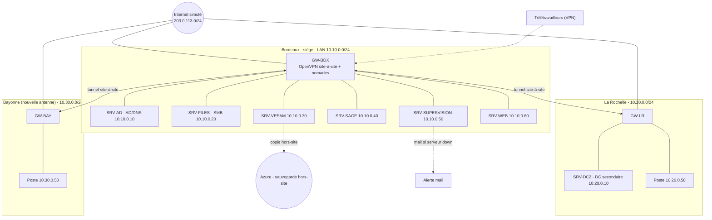
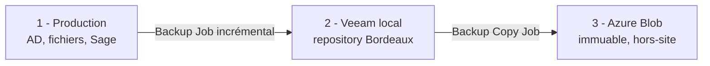

# MSPR FIDUCIS — dossier technique

Cabinet d'expertise comptable, juridique et conseil RH, 35 collaborateurs, répartis sur Bordeaux (siège), La Rochelle, Bayonne (nouvelle antenne) et du télétravail régulier. Aujourd'hui les fichiers sont sur OneDrive, le site vitrine et l'espace client chez un prestataire coûteux, il n'y a ni VPN, ni sauvegarde, ni plan de reprise, et un contrôle CNIL impose de tracer les accès aux données clients. Une coupure Internet d'une journée à La Rochelle a déjà bloqué le travail.

Virtualisation : VirtualBox. Passerelles sous Ubuntu 24.04, serveurs sous Windows Server 2022.

## Réponses aux entretiens

| Demande (entretiens) | Réponse mise en place |
|---|---|
| Accès entre Bordeaux, La Rochelle et le télétravail (pas de VPN, OneDrive aujourd'hui) | VPN site-à-site OpenVPN reliant les LAN en permanence + VPN client pour les télétravailleurs |
| Nouvelle antenne à Bayonne (2e entretien) | Bayonne intégrée comme branche du VPN site-à-site (topologie en étoile, hub Bordeaux) |
| Coupure Internet à La Rochelle (tout était bloqué) | Lien de secours par site dans le PRA ; les services internalisés restent dispo en local |
| Pas de sauvegarde | Sauvegarde 3-2-1 avec Veeam (incrémental), copie hors-site externalisée sur Azure |
| Toutes les données sont sensibles | Chiffrement en transit et au repos, accès en moindre privilège |
| Pas de PRA/PCA | PRA et PCA documentés et testés |
| Traçabilité des accès clients (CNIL, 2e entretien) | Audit NTFS des accès fichiers + journaux centralisés + VPN nominatif |
| Tout rapatrier en interne (2e entretien) | Fichiers sur serveur SMB interne, site web rapatrié en interne |

Ajout : supervision des serveurs avec alerte par mail dès qu'un serveur tombe.

## Architecture

Topologie en étoile : Bordeaux concentre les services, La Rochelle et Bayonne sont des branches reliées par des tunnels chiffrés. Ce choix permet d'ajouter un site (Bayonne) en ajoutant simplement une branche, sans retoucher les autres. Contrepartie (panne du hub) traitée par un DC secondaire à La Rochelle dans le PRA.



### Plan d'adressage

| Rôle | Réseau | Type VirtualBox |
|---|---|---|
| Internet simulé | `203.0.113.0/24` | NAT Network `inet-sim` |
| LAN Bordeaux | `10.10.0.0/24` | Internal `lan-bdx` |
| LAN La Rochelle | `10.20.0.0/24` | Internal `lan-lr` |
| LAN Bayonne | `10.30.0.0/24` | Internal `lan-bay` |
| Tunnel site-à-site | `10.99.0.0/24` | OpenVPN |
| Pool télétravail | `10.8.0.0/24` | OpenVPN |

Passerelles : GW-BDX 203.0.113.11 / 10.10.0.254, GW-LR 203.0.113.12 / 10.20.0.254, GW-BAY 203.0.113.13 / 10.30.0.254. Serveurs Bordeaux : SRV-AD 10.10.0.10, SRV-FILES 10.10.0.20, SRV-VEEAM 10.10.0.30, SRV-SAGE 10.10.0.40, SRV-SUPERVISION 10.10.0.50, SRV-WEB 10.10.0.60. La Rochelle : SRV-DC2 10.20.0.10 + un poste. Bayonne : un poste (10.30.0.50), l'antenne ne portant pas de serveur pour l'instant.

## Maquette VirtualBox

| VM | OS | RAM | Réseaux |
|---|---|---|---|
| GW-BDX | Ubuntu 24.04 | 512 Mo | WAN + LAN Bordeaux |
| GW-LR / GW-BAY | Ubuntu 24.04 | 512 Mo | WAN + LAN du site |
| SRV-AD | Windows Server 2022 | 2 Go | LAN Bordeaux |
| SRV-FILES | Windows Server 2022 | 2 Go | LAN Bordeaux |
| SRV-VEEAM | Windows Server 2022 | 4 Go | LAN Bordeaux |
| SRV-SAGE | Windows Server 2022 | 2 Go | LAN Bordeaux |
| SRV-SUPERVISION | Ubuntu 24.04 | 1 Go | LAN Bordeaux |
| SRV-WEB | Ubuntu 24.04 | 512 Mo | LAN Bordeaux |
| SRV-DC2 | Windows Server 2022 (Core) | 2 Go | LAN La Rochelle |
| Poste La Rochelle / Bayonne | Windows 10/11 | 2 Go | LAN du site |

Le NAT Network `inet-sim` simule Internet : les passerelles s'y voient entre elles et atteignent le vrai Internet pour les mises à jour. Les LAN sont des Internal Networks. La création est scriptée (`scripts/provision-virtualbox.sh`). On démarre les VM par groupe selon la démo plutôt que toutes ensemble.

Le réseau sous Ubuntu 24.04 se configure avec Netplan. Exemple pour la passerelle de Bordeaux (`/etc/netplan/01-fiducis.yaml`, à mettre en chmod 600 puis `sudo netplan apply`) :

```yaml
network:
  version: 2
  renderer: networkd
  ethernets:
    enp0s3:                 # WAN
      addresses: [203.0.113.11/24]
      routes: [{to: default, via: 203.0.113.1}]
    enp0s8:                 # LAN Bordeaux
      addresses: [10.10.0.254/24]
```

Le routage est activé sur les passerelles (`net.ipv4.ip_forward=1`).

## VPN site-à-site (Bordeaux, La Rochelle, Bayonne)

Bordeaux est serveur OpenVPN, La Rochelle et Bayonne sont clients. Bayonne, ouverte au 2e entretien, est raccordée exactement comme La Rochelle : une branche de plus sur l'étoile, sans rien changer aux sites existants. `client-to-client` permet aux deux agences de communiquer en passant par le hub. La PKI (Easy-RSA) génère une autorité de certification et un certificat par passerelle (`scripts/init-pki.sh`). Chaque agence est déclarée dans un fichier CCD avec son IP de tunnel et la route vers son LAN.

Extrait du serveur (`configs/openvpn/server-site2site.conf`) :

```ini
topology subnet
server 10.99.0.0 255.255.255.0
client-config-dir /etc/openvpn/ccd
client-to-client
route 10.20.0.0 255.255.255.0
route 10.30.0.0 255.255.255.0
push "route 10.10.0.0 255.255.255.0"
push "route 10.20.0.0 255.255.255.0"
push "route 10.30.0.0 255.255.255.0"
```

Le fichier CCD de chaque agence (`ccd/larochelle`, `ccd/bayonne`) fixe son IP de tunnel et déclare son réseau avec `iroute`, sans quoi le serveur ne sait pas router le retour. Le pare-feu et le NAT des passerelles sont dans `configs/openvpn/nftables-gw-bdx.conf` : le trafic inter-sites n'est pas NATé, seul l'accès Internet l'est.

## VPN télétravail

Une seconde instance OpenVPN tourne sur Bordeaux (port et sous-réseau distincts du site-à-site), avec un certificat par collaborateur, révocable individuellement — c'est aussi ce qui permet d'identifier nominativement qui se connecte. Le profil `.ovpn` est assemblé par `scripts/make-ovpn.sh`. On reste en split-tunnel : seul le trafic vers les ressources internes passe par le VPN. Une fois connecté, le télétravailleur accède au partage SMB et à Sage selon ses droits AD. Pour révoquer un accès (départ, perte de portable) : `easyrsa revoke`, régénération de la CRL, activation de `crl-verify`.

## Internalisation des fichiers et du web

Les fichiers quittent OneDrive pour un serveur de fichiers Windows (SRV-FILES), avec des partages SMB intégrés à l'AD. Les permissions suivent des groupes AD par métier (comptables, juristes, RH, direction) en moindre privilège, et l'énumération basée sur l'accès masque ce que l'utilisateur n'a pas le droit de voir. La migration depuis OneDrive se fait par export puis copie sur les partages, avec déploiement des lecteurs réseau par GPO.

Le site vitrine, l'espace client et la prise de rendez-vous sont rapatriés en interne sur SRV-WEB (`configs/web/fiducis-vitrine.conf` : HTTPS forcé, en-têtes de sécurité, reverse proxy pour le module de rendez-vous). Le serveur est durci et seuls les ports 80/443 sont redirigés vers lui depuis Internet. Sage reste sur son serveur dédié, désormais joignable depuis toutes les agences via le tunnel et inclus dans les sauvegardes.

## Supervision et alertes

Un serveur de supervision (SRV-SUPERVISION) surveille en continu la disponibilité des serveurs (AD, fichiers, Veeam, Sage, web) et des passerelles. Dès qu'une cible ne répond plus, une alerte est envoyée **par mail** à l'équipe. La supervision repose sur Prometheus (collecte) et Alertmanager (envoi des notifications mail) ; Zabbix est une alternative équivalente.

Règle d'alerte type : une cible considérée « down » pendant plus d'une minute déclenche une notification. La configuration mail d'Alertmanager est dans `configs/monitoring/alertmanager.yml` et la règle de détection dans `configs/monitoring/alert-rules.yml`.

```yaml
# extrait alertmanager.yml — envoi mail
route:
  receiver: equipe-it
receivers:
  - name: equipe-it
    email_configs:
      - to: alertes@fiducis.fr
        from: supervision@fiducis.fr
        smarthost: smtp.fiducis.fr:587
```

Cette supervision sert aussi le PRA : on est prévenu immédiatement d'une panne au lieu de la découvrir quand un utilisateur se plaint.

## Sauvegarde 3-2-1 (Veeam, hors-site Azure)

Trois copies, deux supports différents, une hors-site :



La copie hors-site est externalisée sur **Azure** : un Backup Copy Job Veeam envoie les sauvegardes vers un conteneur Azure Blob, avec immuabilité activée (protection contre la suppression et le ransomware) et chiffrement. Par rapport à une copie sur un autre site, on évite le matériel à maintenir et on bénéficie d'un stockage hors-site élastique.

| Données | Fréquence | Rétention locale | Hors-site (Azure) |
|---|---|---|---|
| Sage (compta/paie) | Quotidienne (incrémental) | 30 jours | 90 jours |
| Fichiers / pièces clients | Quotidienne (incrémental) | 30 jours | 90 jours |
| AD (system state) | Quotidienne | 15 jours | 30 jours |
| Archive mensuelle | Mensuelle (complet) | 12 mois | 12 mois |

On teste réellement les restaurations (un fichier mensuellement, une base Sage et l'AD par trimestre). Une sauvegarde non testée ne compte pas — c'était précisément le maillon manquant. Chaque test fait l'objet d'un PV daté.

## PRA / PCA

| Service | RPO | RTO |
|---|---|---|
| Sage / fichiers clients | 24 h | 4 h |
| Active Directory / DNS | réplication (~0) | < 1 h |
| Site web / espace client | 24 h | 8 h |

Continuité : le DC secondaire de La Rochelle maintient l'authentification en cas de panne du siège ; les services internalisés restent disponibles localement ; la supervision alerte immédiatement en cas de panne. Reprise : restauration depuis le repository Veeam local pour un incident isolé, ou depuis Azure en cas de sinistre Bordeaux. Les runbooks (restauration d'un fichier, sinistre du siège, ransomware) sont écrits pour pouvoir être suivis sans expertise pointue.

À noter pour la coupure Internet vécue à La Rochelle : un VPN seul ne la règle pas, puisque le tunnel a besoin du lien pour monter. La vraie continuité repose sur un lien de secours par site (4G/5G ou second FAI), conçu et documenté dans le PRA mais simulé dans la maquette faute de matériel.

## Traçabilité CNIL

La traçabilité des accès aux fichiers clients s'appuie sur l'audit d'accès aux objets NTFS du serveur de fichiers : une GPO active l'audit du système de fichiers, et des SACL sont posées sur les dossiers sensibles, ce qui journalise qui accède à quel dossier et quand (`configs/ad/audit-fichiers.gpo.md`, évènements 4663/4670). Les journaux sont centralisés vers un collecteur (pour qu'un attaquant ne puisse pas effacer ses traces localement) et conservés de façon proportionnée : environ 6 mois pour les accès, 12 mois pour les évènements de sécurité. S'ajoutent les certificats VPN nominatifs, le chiffrement des données en transit et au repos, et une matrice d'habilitation par groupe AD. On peut ainsi produire, pour un dossier client donné, la liste horodatée des accès demandée par la CNIL.

## Tests principaux

| Test | Résultat attendu |
|---|---|
| Tunnels site-à-site | La Rochelle et Bayonne connectés au hub |
| Communication inter-agences | La Rochelle joint Bayonne via le hub |
| Accès aux ressources | Sage et partage SMB accessibles depuis une agence distante |
| VPN télétravail | Connexion, accès interne, révocation d'un certificat refusée |
| Sauvegarde / restauration | Backup Veeam, copie présente sur Azure, fichier restauré intègre |
| Supervision | Arrêter un serveur déclenche bien un mail d'alerte |
| Audit NTFS | Un accès à un dossier sensible génère un évènement horodaté |

## Contenu du dépôt

- `configs/openvpn/` : serveurs et clients (site-à-site Bordeaux/La Rochelle/Bayonne + télétravail), CCD, pare-feu nftables
- `configs/web/` : configuration du site vitrine interne
- `configs/ad/` : GPO d'audit des accès fichiers (CNIL)
- `configs/monitoring/` : Alertmanager (mail) et règles d'alerte
- `scripts/` : provisioning VirtualBox, génération de la PKI, profils .ovpn

Les certificats et clés ne sont pas versionnés (voir `.gitignore`) ; ils se génèrent avec `scripts/init-pki.sh` et `scripts/make-ovpn.sh`.
